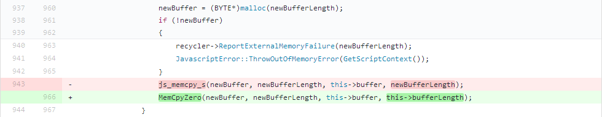
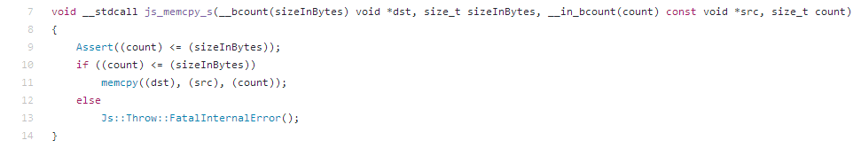
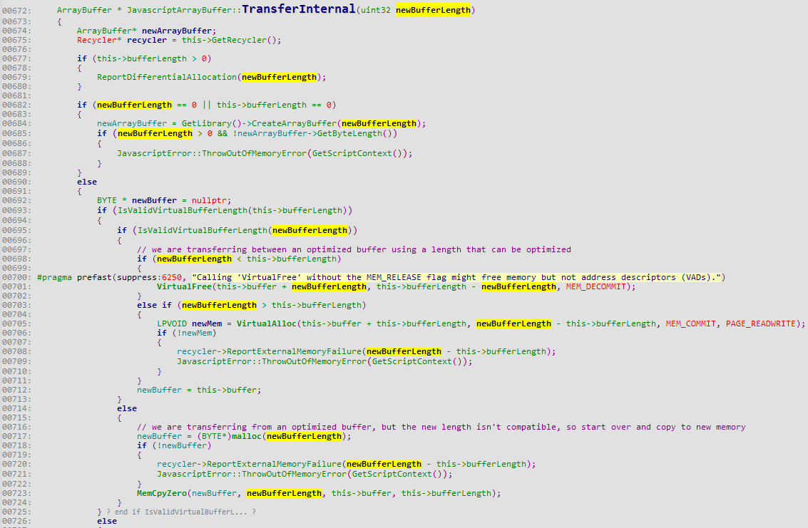
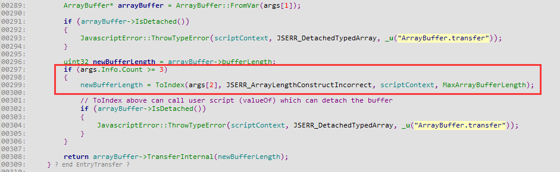
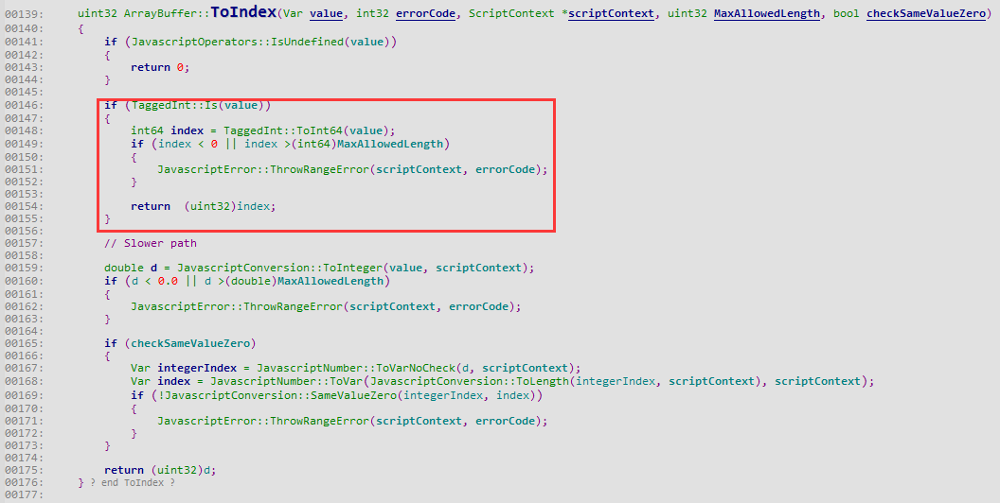
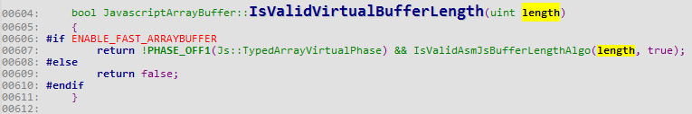
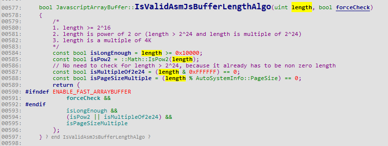
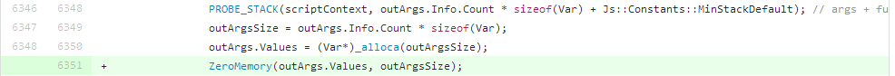

###out of bound -- 越界访问

####经典的memcpy() 复制越界

diff 里有一段关于memcpy() 的经典修复 

 

js_memcpy_s() 的代码对memcpy() 做了一层封装,源码如下: 

 

MemCpyZero() 也对js_memcpy_s() 做一层封装,同时也

往上阅读代码,发现`newBufferLength` 是参数 

 

`TransferInternal()` 函数由`EntryTransefer()` 调用,阅读源码时发现`newBufferLength` 由第三个参数控制,这个参数可以接收integer 类型的变量 

 

 

现在知道,只要通过调用`transfer()` 并传递参数即可控制`newBufferLength` .回过去看`TranseferInternal()` 的两处if 判断`if (IsValidVirtualBufferLength(this->bufferLength))` 和`if (IsValidVirtualBufferLength(newBufferLength))` . 

 

 

IsValidVirtualBufferLength() 里`PHASE_OFF1()` 是一处全局类型检测,忽略掉,关注点在于IsValidAsmJsBufferLengthAlgo() .首先我们阅读diff ,要让代码执行流程到`js_memcpy_s()` ,必须要满足IsValidVirtualBufferLength(this->bufferLength) 等于true ,IsValidVirtualBufferLength(newBufferLength) 等于false .那么可以创建长度为0x100000 的buffer ,满足IsValidVirtualBufferLength() 的判断.然后`newBufferLength` 小于0x100000 让IsValidVirtualBufferLength() 返回false .执行到diff 处的代码之后,malloc 会申请新的内存,重点在于js_memcpy_s() .newBufferLength 可以任意控制,于是可以任意申请内存空间,之所以要用MemCpyZero() 替换js_memcpy_s() 的原因,是因为js_memcpy_s() 没有对从堆中申请的内存做清空的操作,导致可能把原来释放掉的数据重新引用,故使用MemCpyZero() 来规避这个问题 

####经典的内存分配未初始化问题

 

  _alloca() 在栈上分配一块新空间后直接使用,没有对新分配的内存做保存,很有可能会导致信息泄漏或者uaf (释放后重引用). 

function test() {
    var max=10;
    
    return function test1(a) {
        console.log(max);
    }
}

function test2() {
    var max=100;
    
    return function test1(a) {
        console.log(max);
    }
}

var a=test();
var b=test2();

a(101);
b(101);

