###diff note -- diff 阅读笔记

####intro

在阅读Chakra diff 时,从下面这段diff 中领悟了JavaScript 中的漏洞成因 

 

这时一段很普通的diff ,主要是重构了arr->GetLength() 的调用,保存到length 中.怎么看也没有特别的地方,但是我在这里领悟到一处精髓 

**在JavaScript 里length 是可以被控制的**,进去阅读GetLength() 的源码,并没有特别的地方,只是对结构上的长度做一处引用 

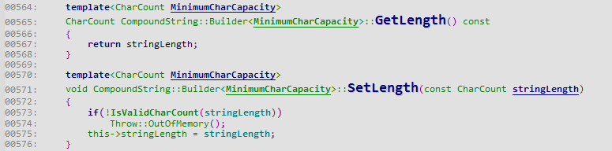 

语言的底层结构都是这样:连续的数据,必然会有长度.比如我们有一个String 对象('12345678'),字符串'12345678' 在内存中的长度为8 ,通常地,我们会在C 语言里这样来使用这个字符串 

    int copy_buffer(char* output_buffer) {
        char* string="12345678";
    
        memcpy(output_buffer,string,strlen(string));
    
        return strlen(string);
    }

这样的实现需要调用到两次strlen() ,性能就慢了很多,于是继续优化,代码 

    int copy_buffer(char* output_buffer) {
        char* string="12345678";
        int   string_length=strlen(string);
    
        memcpy(output_buffer,string,string_length);
    
        return string_length;
    }

优化之后,只需要调用一次strlen() 来计算字符串的长度,提高了代码的性能.在脚本类语言里,解析器为了能够提升性能,往往会把长度保存在对象的内存结构上,比如上面的例子,C 语言和Python 中的字符串'12345678' 在内存中的表示 

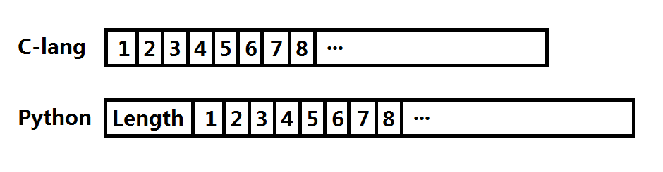 

Python 解析器以后需要使用对象中的字符串时,就不再需要重新计算长度,直接访问这个Length 字段即可获取字符串的长度,Python String 结构如下 

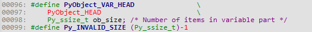 

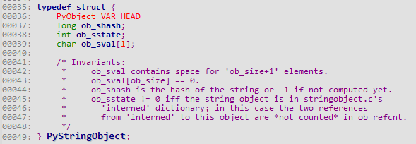 

那么JavaScript 为什么可以修改Length 呢? 

上面说到,解析器内部的数据对象结构中有一个length ,除此之外,JavaScript 本身也有一个对象属性length ,**往往一些JavaScript 解析器引起的漏洞就是误用到了这个属性对象里面的length ,导致用户控制操作的长度,造成OOB 越界漏洞**.下面是CVE-2017-0141 diff 修复例子 

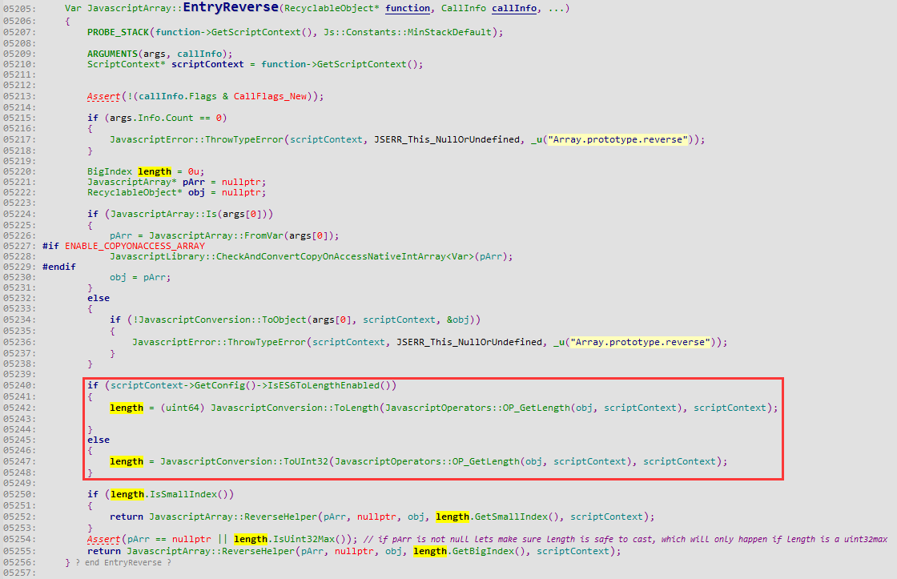 

length 从Array 对象中的Length 属性中读取,然后传递到JavascriptArray::ReverseHelper() 中被调用.在diff 中通过强制让length 等于Array 的真实长度而不是属性中的长度来修复漏洞 

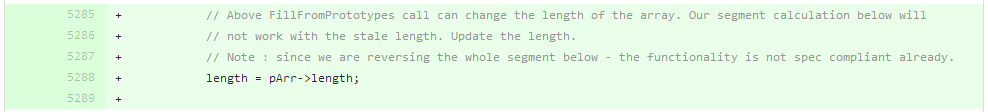 

第二处diff 是对于length 的检测,不允许超过真实的长度 

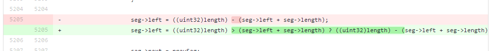 

我们先去看diff 过后的代码 

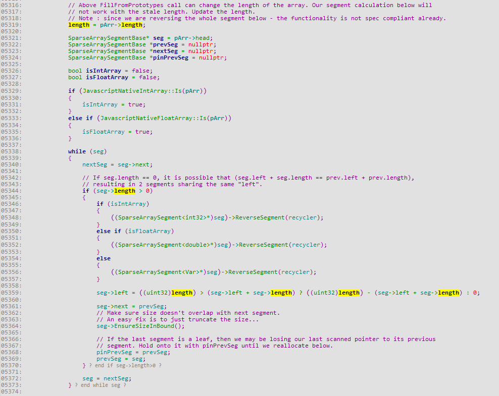 

如果没有`length=pArr->length` 的限制,此时length 能够由用户设置length 属性修改,在`seg->left=((uint32)length)-(seg->left+seg->length)` 的计算中能够控制`seg->left` 的值.在`EnsureSizeInBound()` 中引发`seg->left` 的使用 

####how to read diff

先来阅读CVE-2016-10229 的修复diff  

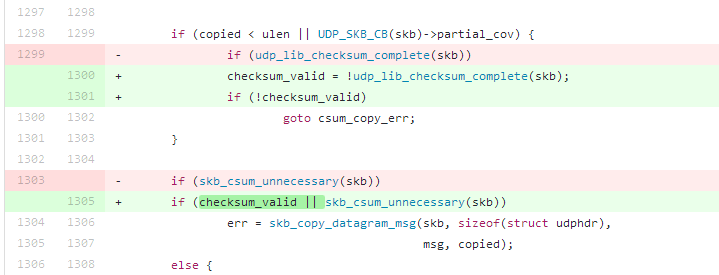 

就这段代码来推理,漏洞根本就没有修复:因为`checksum_valid=!idp_lib_checksum_complete(skb)  if (!checksum_valid)` 等价于`if (udp_lib_checksum_complete(skb))` ,当`udp_lib_checksum_complete()` 执行过后,下面的if 判断又会回到`skb_copy_datagram_msg()` 里,好像这个判断根本就没有意义呀 

看diff 的时候不能针对diff 修改的那一段代码来阅读,**数据从修改的那处diff 的前面传递过来,漏洞在修改diff 的后面那部分触发**,读diff 的时候多往前后阅读,很多疑惑都会解开,比如CVE-2016-10229 的diff ,往下阅读就能够了解到更多细节 

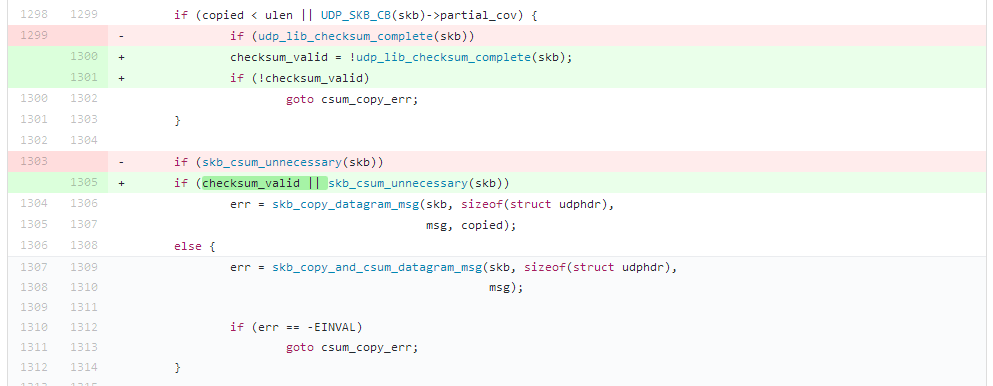 

未修复代码之前,`udp_lib_checksum_complete(skb)` 为false 时会继续往下运行,当`skb_csum_unnecessary(skb)` 返回false 的时候,代码则会调用到`skb_copy_and_csum_datagram_msg()` 函数,翻看源码,找到两处函数的声明 

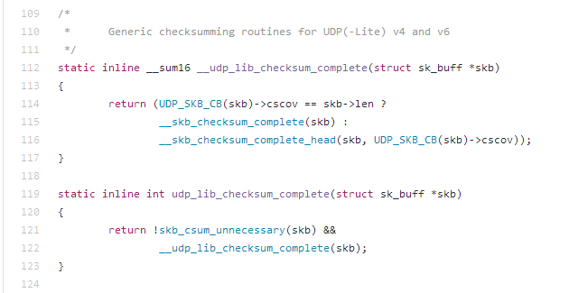 

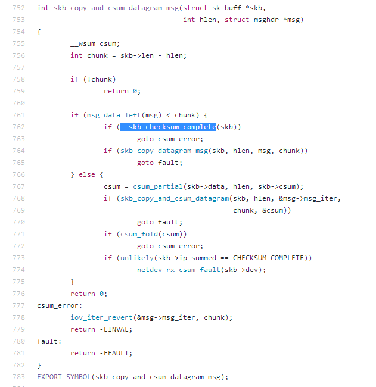 

再结合漏洞修复提示 

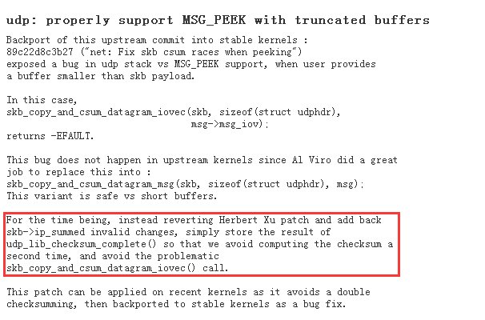 

现在大致了解到触发漏洞代码流执行过程,回过头去看diff 修复代码,当第一次`udp_lib_checksum_complete()` 执行之后,`checksum_valid` 为true ,避免接下来的if 判断执行到else 中,导致两次checksum 的计算触发漏洞 

