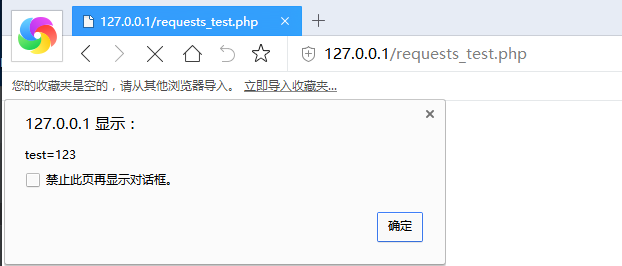
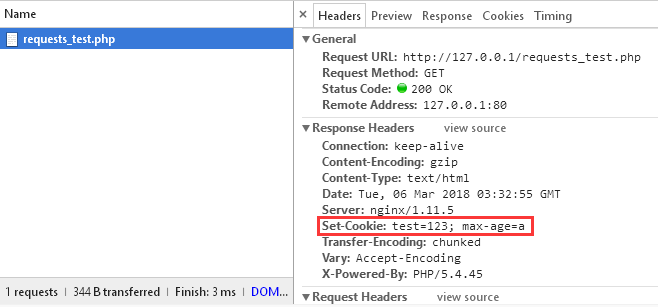
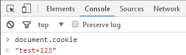
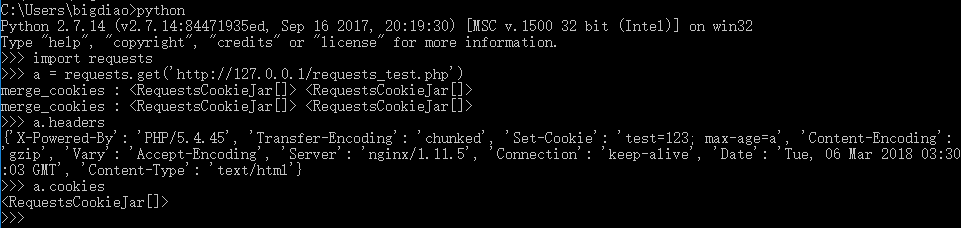
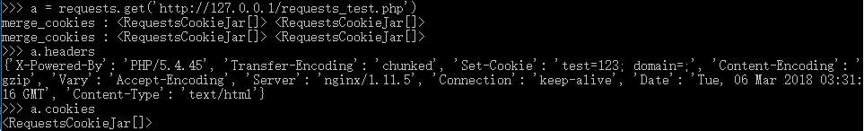

##  Python Cookielib 0-day PoC

  先上PoC (PHP 版)

```

    header('Set-Cookie: test=123; max-age=a');  //  PoC 1
    header('Set-Cookie: test=123; domain=;');  //  PoC 2
    
```

  PoC 浏览器端验证







  PoC 1/2 在Python Requests 库中的验证






##  Cookielib 0-day PoC 反Python 爬虫的应用

  PoC Demo Source for PHP 

```

    <?php

    session_start();

    if (!isset($_SESSION['username'])) {
        $_SESSION['username'] = 'root';

        echo 'Reflash for get tips .SID = ' . session_id();

        header('Set-Cookie: PHPSESSID=' . session_id() . '; max-age=a');  // PoC 1
    } else {
        echo 'Your username is ' . $_SESSION['username'];

        session_destroy();
    }

    ?>

```

  Demo 代码不作演示,请自行测试效果
  

##  Cookieslib 0-day 源码分析

  上面的PoC 导致Cookielib 解析`Set-Cookie` 数据包头出现异常的代码在`lib/cookielib.py` 第1415 行和1434 行

```

    if k == "domain":                  #  lib/cookielib.py:1411
        if v is None:                  #  lib/cookielib.py:1412
            _debug("   missing value for domain attribute")
            bad_cookie = True
            break                      #  lib/cookielib.py:1415
        # RFC 2965 section 3.3.3
        v = v.lower()
    if k == "expires":
        if max_age_set:
            # Prefer max-age to expires (like Mozilla)
            continue
        if v is None:
            _debug("   missing or invalid value for expires "
                  "attribute: treating as session cookie")
            continue
    if k == "max-age":                 #  lib/cookielib.py:1426
        max_age_set = True
        try:
            v = int(v)                 #  lib/cookielib.py:1429
        except ValueError:
            _debug("   missing or invalid (non-numeric) value for "
                  "max-age attribute")
            bad_cookie = True
            break                      #  lib/cookielib.py:1434

```

  Cookielib 在解析Cookie 数据时,会对Cookie 的设置(比如:Cookie 使用域,Cookie 过期时间等)进行解析.先回顾PoC 1 
  
```

    header('Set-Cookie: test=123; max-age=a');  //  PoC 1

```
  
  当代码执行到`lib/cookielib.py` 第1426 行时,判断Cookie 设置属性是否为`max-age` ,接下来会把`max-age` 的值尝试用`int()` 转换,PoC 1 中填写一个字符,导致1429 行代码`v = int(v)` int() 转换失败,触发异常,退出对当前的Cookie 进行处理.也就是说,Cookielib 丢弃掉这条Cookie 记录,没有完全返回服务器端给我们的Set-Cookie 记录

  再看看PoC 2 的代码

```

    header('Set-Cookie: test=123; domain=;');  //  PoC 2

```
  
  `domain` 的值为空,导致`lib/cookielib.py` 第1412 行代码判断成立,执行到break 语句,跳过当前的Cookie 处理


##  第二个Cookieslib 0-day 源码分析

  前面触发问题是来源于函数`_normalized_cookie_tuples()` 的代码,往上追溯,到`_cookies_from_attrs_set()`

```

    def _cookies_from_attrs_set(self, attrs_set, request):
        cookie_tuples = self._normalized_cookie_tuples(attrs_set)

        cookies = []
        for tup in cookie_tuples:
            cookie = self._cookie_from_cookie_tuple(tup, request)    #  lib/cookielib.py:1555
            if cookie: cookies.append(cookie)                        #  lib/cookielib.py:1556
        return cookies
        
```

  `_cookies_from_attrs_set()` 函数通过`_normalized_cookie_tuples1()` 把Set-Cookies 处理好之后,得到cookie_tuples ,前面的两个PoC 会让Set-Cookies 的记录没有正确返回到cookie_tuples .接下来,CookieLib 通过`_cookie_from_cookie_tuple` 对cookie 的设置进行进一步处理,问题产生在`lib/cookielib.py:1472` 

```

    def _cookie_from_cookie_tuple(self, tup, request):
        # standard is dict of standard cookie-attributes, rest is dict of the
        # rest of them
        name, value, standard, rest = tup

        domain = standard.get("domain", Absent)
        path = standard.get("path", Absent)
        port = standard.get("port", Absent)
        expires = standard.get("expires", Absent)

        # set the easy defaults
        version = standard.get("version", None)  #  lib/cookielib.py:1469
        if version is not None:
            try:
                version = int(version)           #  lib/cookielib.py:1472
            except ValueError:
                return None  # invalid version, ignore cookie
        secure = standard.get("secure", False)
        # (discard is also set if expires is Absent)
        discard = standard.get("discard", False)
        comment = standard.get("comment", None)
        comment_url = standard.get("commenturl", None)

```

  `lib/cookielib.py` 1469行代码尝试获取Cookie 的设置,这里是要获取`version` 字段的值,接下来判断`version` 字段是否能被`int()` 函数转换成数值,同样的道理,把值换成字符串即可产生异常,导致`lib/cookielib.py:1472` 触发异常,执行`return None` .回去看代码`lib/cookielib.py:1555` ,cookie = None ,导致`lib/cookielib.py:1556` 的判断失效,没有把这个经过处理的Cookie 添加到要返回的结果列表

  PoC 如下:

```

    header('Set-Cookie: test=123; version=a;');  //  PoC 3

```

