##  第一章  泡沫开始的时候

工作休息的时候第一件事就是点开APP 看看帐户的XRP 涨了多少.每一次点开炒币APP 的时候,几乎所有的币都涨得飞起,真是太诱人了

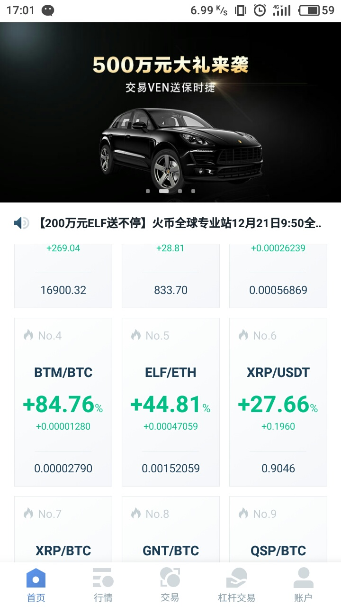

终于回到家了,一天的工作总算是忙到头,倒一罐可乐躺在沙发上,刷刷APP 看看行情.哦,看来又涨了不少

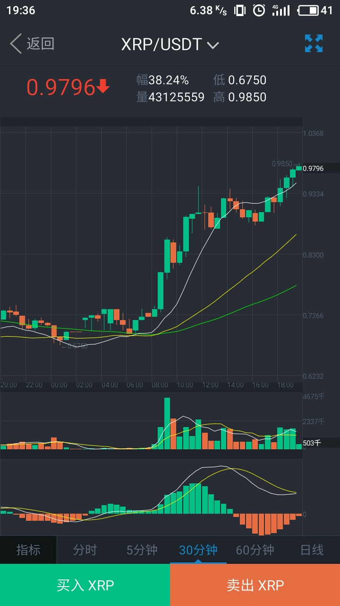

时间流逝得真快,又再刷刷手机看行情,又涨了不少

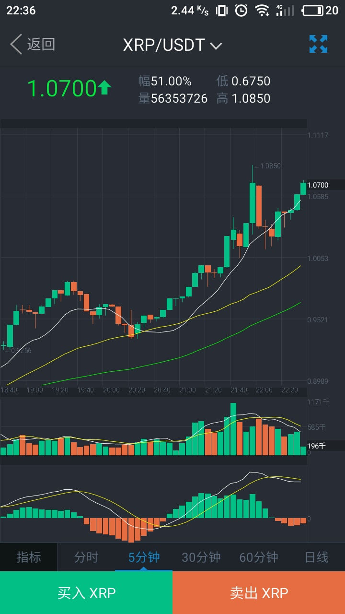

我轻轻地笑出了声音,**一切就像梦一样**.所谓财富,也不过如此.经历过经济泡沫不断变大这个过程的人对此感触更强烈.举个例子,15 年中之前在深圳买了房的人,经历了这16 - 17 两年的房价上涨,大部份的房子都涨价不少,只是房子涨价周期比炒币长,如果一天就涨了50 % 呢?我们来看看泡沫发展过程

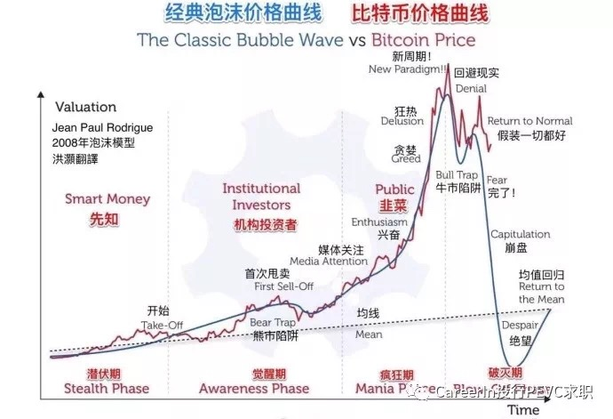

17 年11 月到12 月,正是币圈泡沫最大的时候,在上图里对应到疯狂期.疯狂期有多疯狂,不妨来看一些过去的K 线数据

一路高歌猛进的XRP

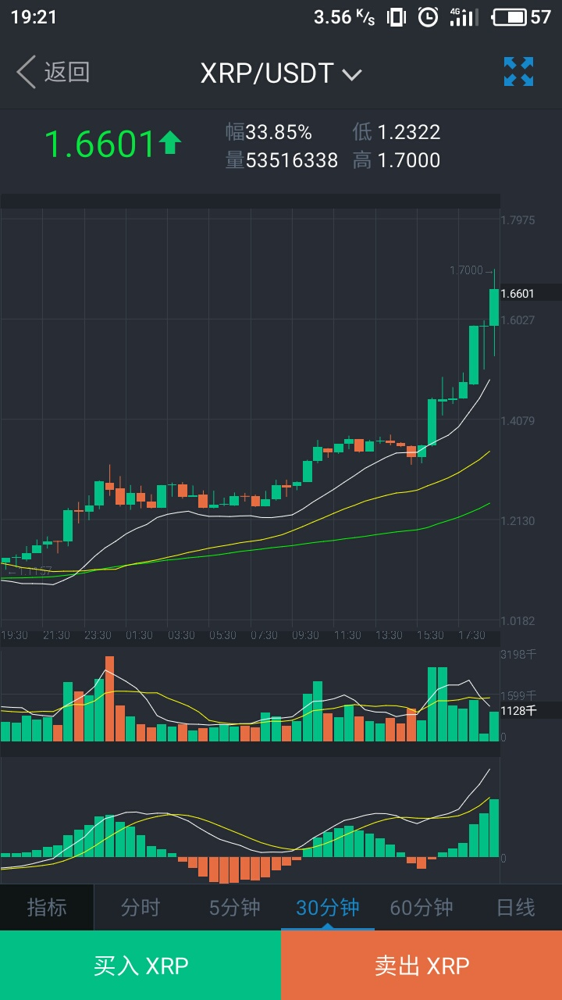

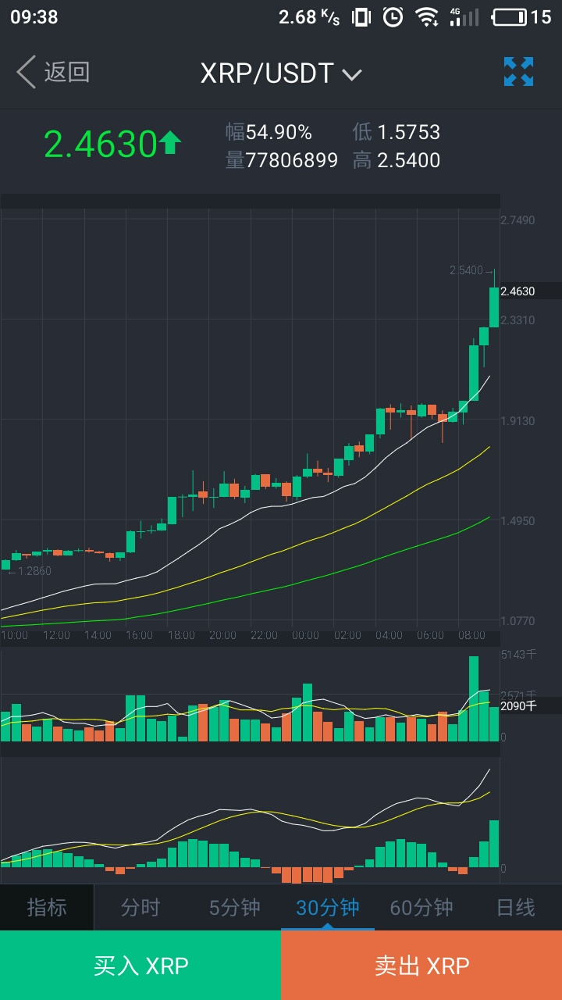

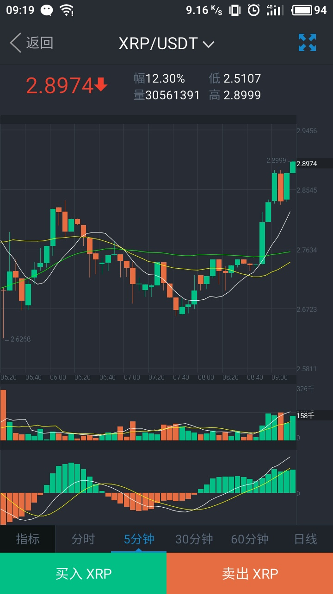

其他币种

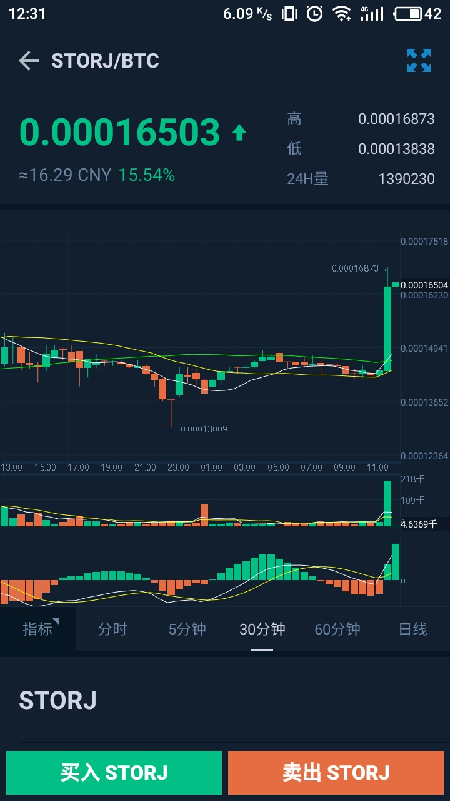

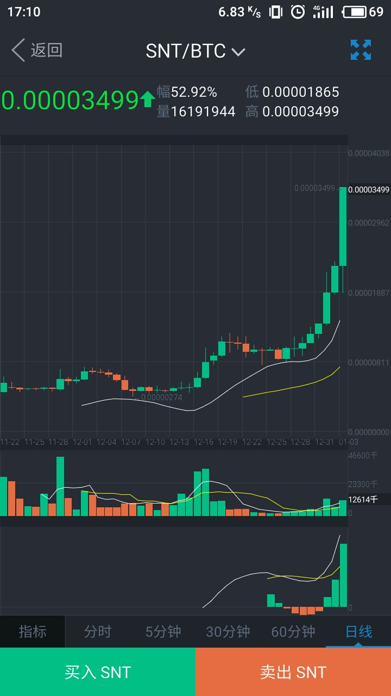

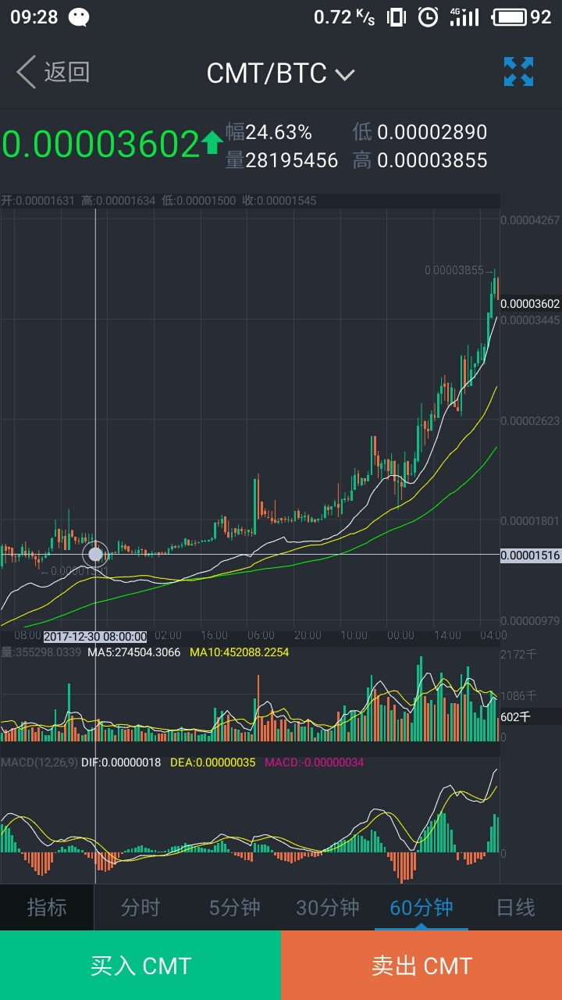

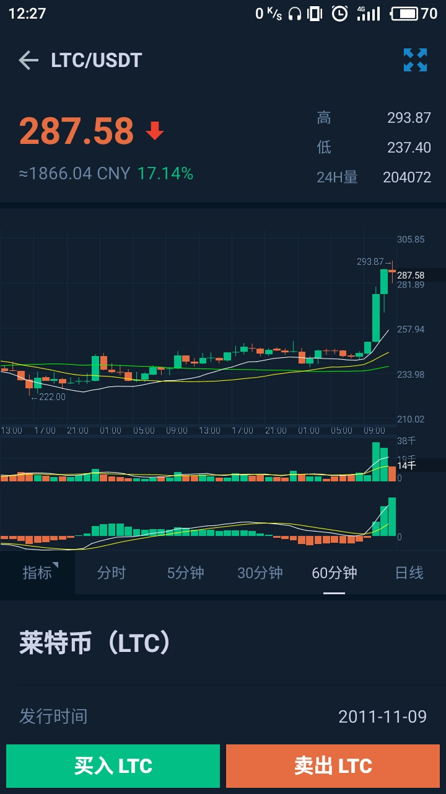

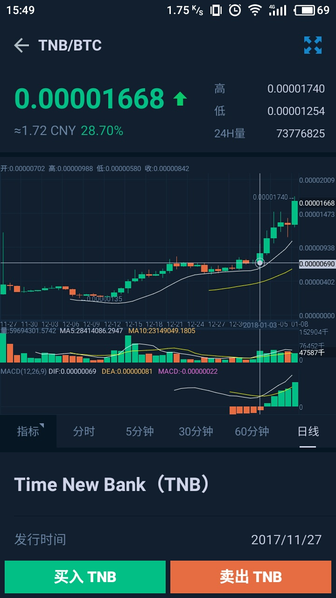

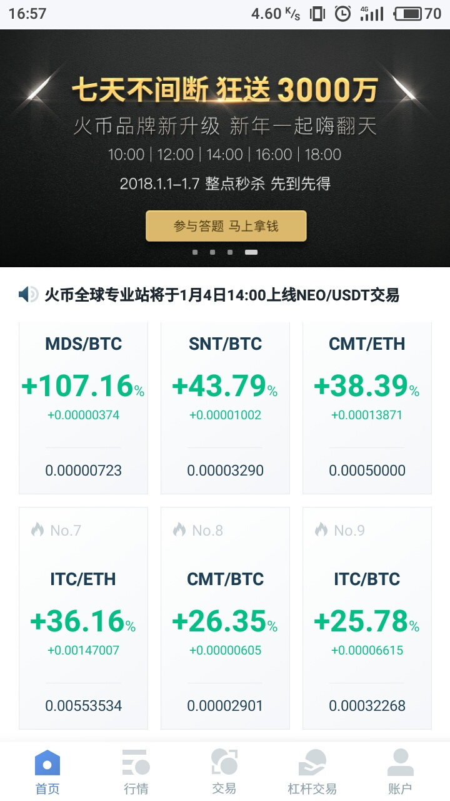

**一切就像梦一样**,17 年12 月下旬,泡沫破裂了,几乎所有的币价开始疯狂下跌

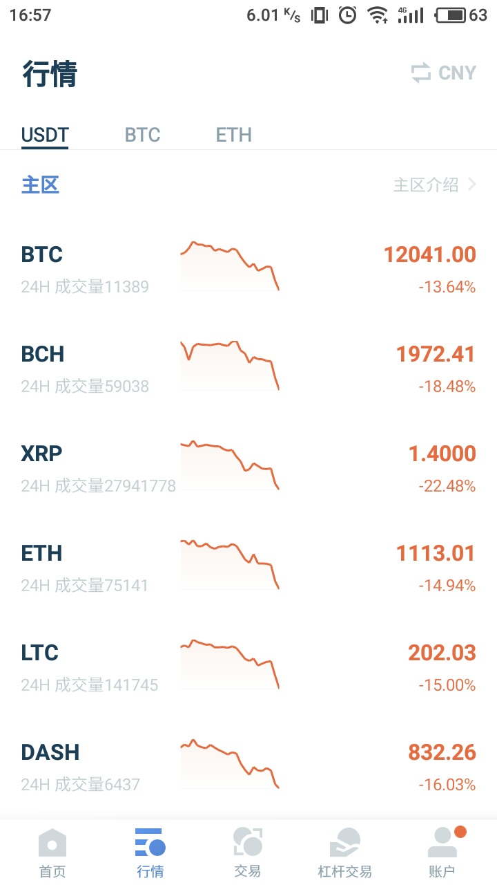

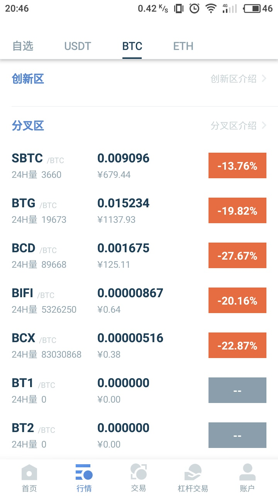

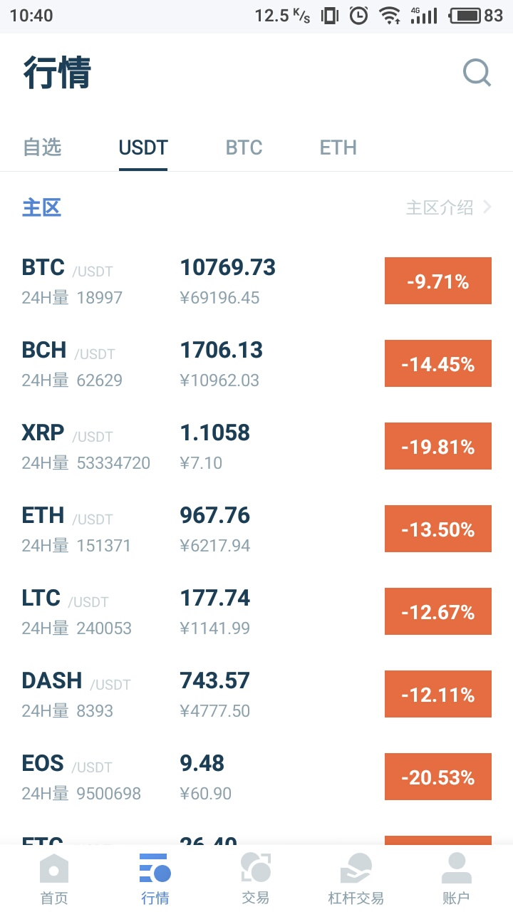

在机缘巧合的状态下开始接触到炒币,也正是从17 年11 月开始进入币圈这个坑.开始对区块链的了解,只是从它的技术原理上去明白它解决了互信的问题.后来才明白,在比特币产生之初,区块链是BTC 的底层支撑技术,人们是从BTC 的源码上提炼出这个精妙的设计,沿用基本思想不断创新.

笔者写下我和区块链的故事,记录了从开始接触区块链技术,到深入币圈的一些经历,并结合一些相关知识来总结半年过去的成长.半年以来感悟颇深的一句话:**人脉六成,技术四成.无论是做产品,还是个人成长,人脉对于自身发展来说太重要了**.举个例子,有个朋友的技术并不厉害,但是他因为和某家大公司里面的人比较熟,比较容易地就拿到高薪offer ;有个外包团队,认识一些公司的采购,一个很普通的资产管理系统(WEB 开发,主要功能是记录,查找,筛选数据,并没有什么难度),采购价120 万人民币.这里边到底给了采购多少成的抽水,估计只有鬼才知道了.
