##  第十章  K 线不说谎

前面几章里我们只是说到K 线和成交量,其他的东西还没有提到,那么先来看看OKEx 的交易界面:

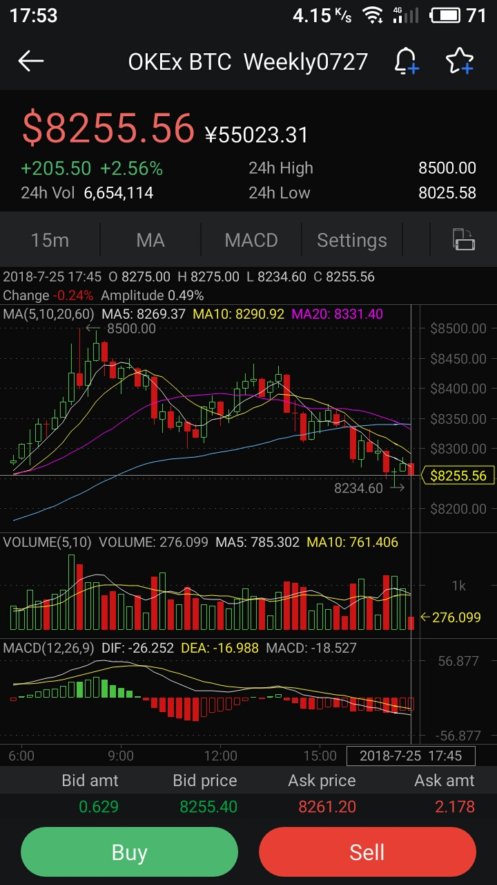

相信大部分的数据读者们都能看明白,不知道读者们有没有关注到这个按钮.

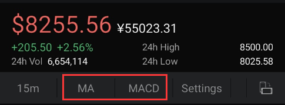

MACD 简单地说就是均线.我们在K 线数据里面看到的白色和黄色就是MACD 的均线.

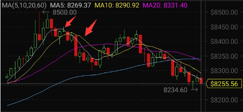

下图这个位置里还有MACD 的数据视图.

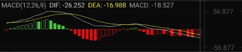

细心留意的读者会发现,MACD 的白色线和黄色线是有交叉的位置的.

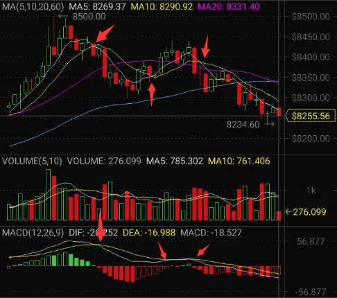

这就是金叉和死叉.白色线向上穿过黄色线是金叉信号(意味着会上涨),白色线向下穿过黄色线是死叉信号(意味着会下跌).下图示例:

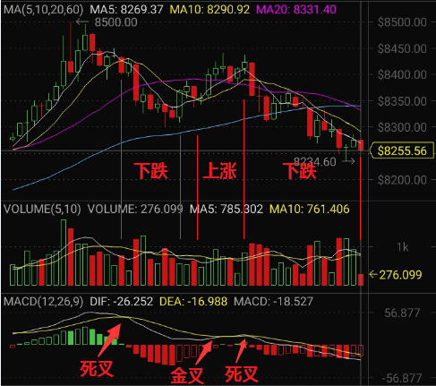

切换MACD 成BOLL ,再来观察视图.

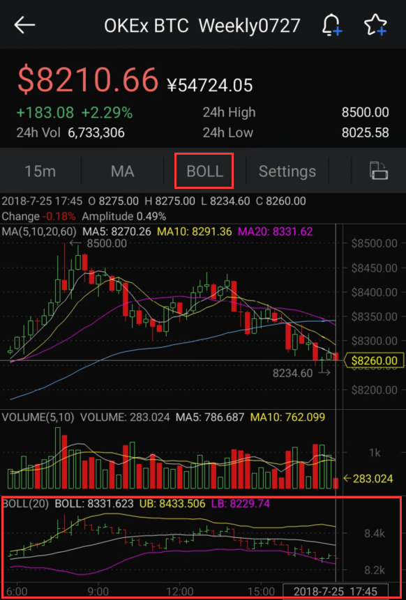

布林带分为上轨中轨下轨,一般来说,K 线数据上涨越过布林带上轨,也就是说后续还存在上涨趋势,反之亦然.

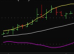

布林带一般作为涨跌剧烈程度的参考,涨跌幅度越大,布林带上下轨的距离越宽,横盘的时候上下轨距离就会比较窄.

是不是感觉自己可以在币市上一试身手了,预测未来了.且慢,这些辅助线其实是需要依靠以有的数据才可以计算出来结果,就算是使用分时线来看MACD 也无法立马得出金叉和死叉的信号,不妨回来看看这段K 线.

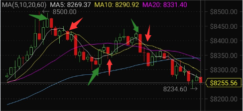

在8500 美元这个位置开始下跌,延迟了1 小时之后才发出来死叉信号.接下来在小波谷里,突然间从8308 美元拉升至8368.67 美元,金叉信号也延迟了半小时才发出来.所以,金叉和死叉的信号,包括大部分的技术指标其实都是滞后的信息,并不能实时地反映出来.最可靠的预测方法就是计算压力位和支撑点.在讨论压力位和支撑点之前,先来说说市场上买卖两方.

买卖双方是对手.卖方是做空和抛售现货的一方(空头),买方是做多和抄底的一方(多头).多头实力比空头强,也就是买方实力强,价格就会被拉上来,反过来一样.无论是买方还是卖方,心里都会有一个预期的价位.比方说买方觉得ETH 跌到470 美元就是底了,那么就会在472 美元附近开始补仓;卖方认为478 是高位了,他们就会在这附近开始抛售手中的现货.

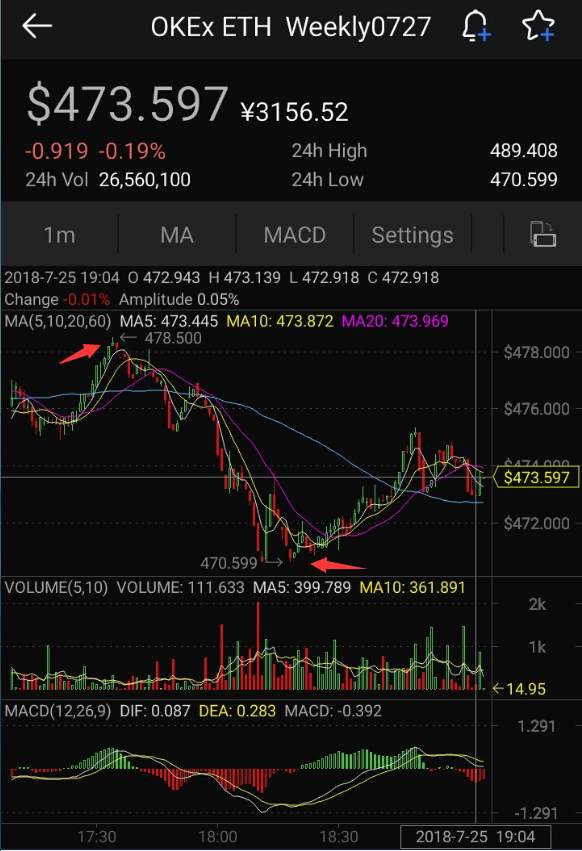

压力位是值图中最高点的那个位置(478.5 $),支撑点是指图中最低点的那个位置(470.599 $).**压力位和支撑点可以用来推测买卖双方的心里价位**.

前面说到,买卖双方都有一个心里价位.以抄底为例子,买方都认为ETH 跌到470 美元是底了,大家都在使劲抄底,如果ETH 价格还在继续下跌,买方就开始慌了,原来他们认为的底还不是底,再下一次抄底之前,买方会继续观察场上的价格走势或者卖出手中的现货割肉,此时卖方实力比买方强,价格跌破支撑点之后还会继续往下跌,**下跌超过买方的心里预期**;价格上涨超过压力位也是一样的道理,原本在压力位之前抛售现货的卖方看到成交的价格还在不断上涨,超出了心里的预期,于是大家都在追高,拉升市场上的成交价.

读者们还记得泡沫开始的时候吗.**一切都像梦一样**,市场上的散户大家都在追高,看着价格每天都在不断上涨,没有买进就像亏本一样心痛.在这种**傻子买入都能赚钱的时候,泡沫早就来到了**,这种不断上涨的时候就是庄家不断出货的时候,只是庄家做得比较隐蔽,慢慢地一点一点地抛掉,在K 线上根本感受不到.

庄家控盘,他们会在价低的时候不断吸筹码(现金购买币).庄家会计算自身的资金能否接住当前场上抛售的现货,接下来,他们会散播利好消息到各个地方和内部群体,然后再慢慢买入拉盘.拉盘的动作不能够太猛,否则散户就会抛售手中的现货,提高庄家拉盘的成本.在构造好不断上涨的K 线之后,开始吸引散户的资金进来,庄家会在这个时候慢慢地抛出手中的现货,换取现金.一旦没有后续的资金进来接盘,K 线会在顶峰开始直线下跌,回顾BTC 最高点的K 线.

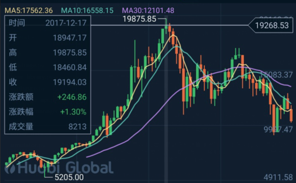

BTC 在19875.85 美元这个位置开始没有新资金进来,大家也觉得价格够高了,于是纷纷抛售,如果市场上有人能把抛售的BTC 都给接盘,那么后面还不会立即下跌,而是过一段时间再下跌.为什么呢?

这就是资金盘.关于资金盘此处就不细说了,推荐阅读链接  https://zhuanlan.zhihu.com/p/19956481 .

币市是一个资金盘的游戏,人民币背后有人民银行的等值资产挂钩,但是BTC 只是一串数字资产,能够让BTC 几年涨几万倍的价格,很大一部分的原因是洗钱和地下资金的进入,拉高了BTC 的价格.洗钱和地下资金转移是刚需,只要市场上还有这些需求,BTC ,数字资产的价值就永远不会归零.

最后分享老狼的经典句子,对笔者受用很大.

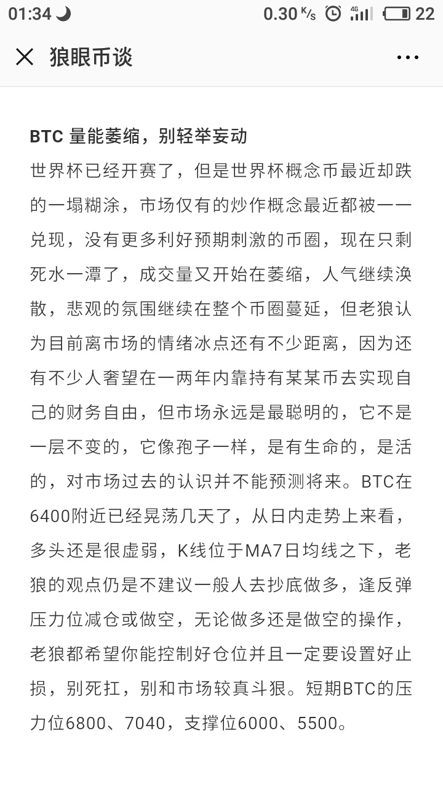

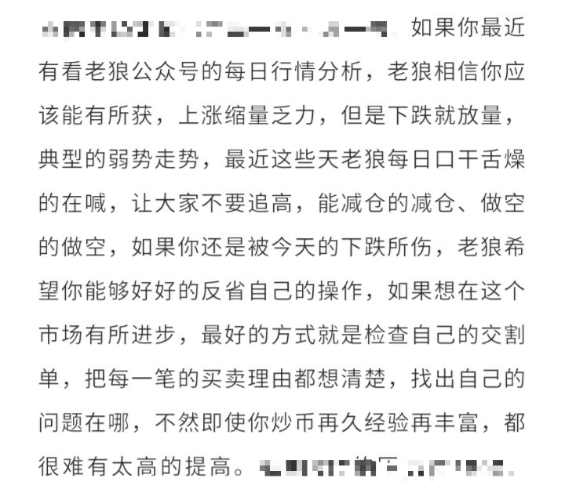

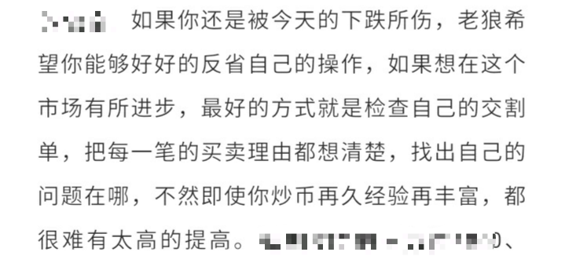

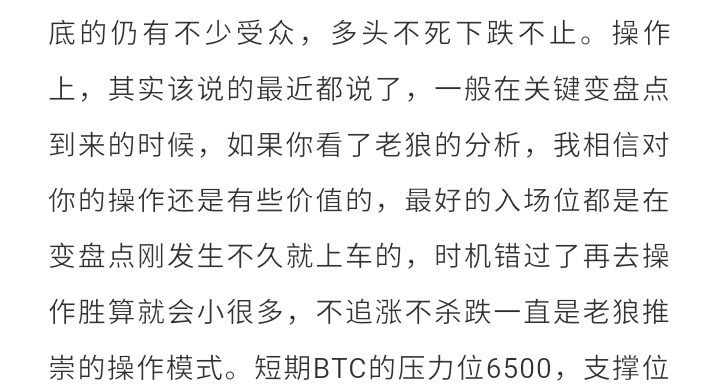
