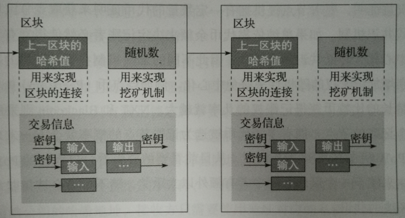
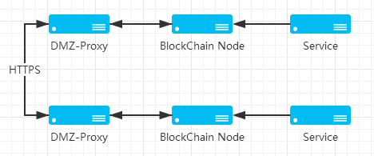
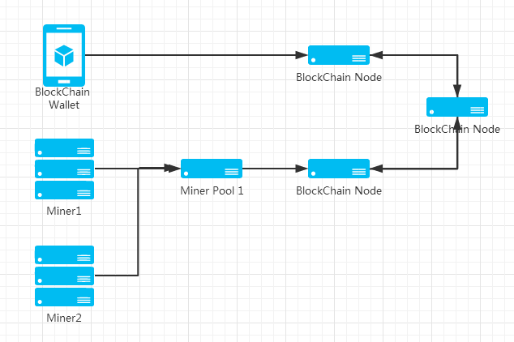

##  第二章  区块链小记


接触区块链,不得不提到挖矿.区块链构造区块需要使用到PoW 机制(Proof of Work ,工作量证明),PoW 机制是让链上的节点来找到一个满足区块难度的Nonce .具体的实现是不断地进行**Sha256** 哈希运算,找到一个符合难度的值即可:

```

    test1   -> 1b4f0e9851971998e732078544c96b36c3d01cedf7caa332359d6f1d83567014
    test2   -> 4790e356c7ddee1b8e090d4a0c5879a3bafb15709940032ba8320e4ce878cdb9
    test3   -> e79ad86c5a58f577cfa618b0c08ddb91a67dacdfa2b254a2c54dd9c4422f11ea

```

上面的示例数据是字符+Nonce 生成对应的哈希值的列表.test1 指的是字符串test1 ,循环计算1 次哈希值;test3 指的是字符串test3 ,循环计算3 次哈希值.示例代码如下:

```python

    import hashlib


    def sha256(data,loop = 1) :
        sha256_object = hashlib.sha256()
        result = data + str(loop)

        for index in range(loop) :
            sha256_object.update(result)

            result = sha256_object.digest()

        return sha256_object.hexdigest()

    print sha256('test',3)

```

在不断循环哈希计算的过程中,我们会发现一些以`0`开头的哈希值.筛选代码

```python

    import hashlib


    def sha256(data,loop = 1) :
        sha256_object = hashlib.sha256()
        result = data + str(loop)

        for index in range(loop) :
            sha256_object.update(result)

            result = sha256_object.digest()

        return sha256_object.hexdigest()


    for index in range(100) :
        result_hash = sha256('test',index)

        if result_hash.startswith('0') :
            print 'test%d -> %s' % (index,result_hash)

```

搜索结果,可以看到有4 个以0 开头的hash 值

```

    test64 -> 0c459ae6ac91ba06ba3fafdb2d22d26b79218b81bd35691672c0ed29f68e1245
    test65 -> 0066e5a675270a345081c9ee698939b3b4158bce4ee5670b8a37afa6f573925c
    test85 -> 0353f1914853b3c899c4a9f676978061cd8c89077b8ae3c31041980b0892d779
    test89 -> 09a1ff113db1468c0882f9bafed36391a257c864682291872af1d70ee25a77a5

```

区块链为了实现去中心化和控制出块难度而引入区块难度.区块难度的作用在于控制hash 碰撞的结果必须要小于某个指定的数值.假设当前的区块难度为0x000FFFFFFFFFFFFFFFFFFFFFFFFFFFFFFFFFFFFFFFFFFFFFFFFFFFFFFFFFFFFF (64 字节),矿工在挖矿的过程中必须要找到小于这个数值的hash ,从而求出了Nonce 的值

```python

    import hashlib


    def sha256(data,loop = 1) :
        sha256_object = hashlib.sha256()
        result = data + str(loop)

        for index in range(loop) :
            sha256_object.update(result)

            result = sha256_object.digest()

        return sha256_object.hexdigest()


    diffcult_target = '0x000FFFFFFFFFFFFFFFFFFFFFFFFFFFFFFFFFFFFFFFFFFFFFFFFFFFFFFFFFFFFF'
    search_target = diffcult_target![ 2 : diffcult_target.find('F') ]
    #  注意:碰撞程序只关心计算出来的结果的前面四个零是否能包含,因为:
    #  0x0000FFFF > 0x00001a2b , 只关注前面的哈希值前面的结果即可
    index = 1

    while True :
        result_hash = sha256('test',index)

        if result_hash.startswith(search_target) :
            print 'test%d -> %s' % (index,result_hash)

            exit()
            
        index += 1

```

最后找到`test25545` 符合结果,即`Nonce = 25545`.给这段代码添加处理用时的功能,更直观地感受不同配置的CPU 速度对挖矿速度的影响,笔者的CPU 是i7 3770k 4.0 G ,消耗的时间为316 秒.

```python

    import hashlib
    import time               #  1


    def sha256(data,loop = 1) :
        sha256_object = hashlib.sha256()
        result = data + str(loop)

        for index in range(loop) :
            sha256_object.update(result)

            result = sha256_object.digest()

        return sha256_object.hexdigest()


    diffcult_target = '0x000FFFFFFFFFFFFFFFFFFFFFFFFFFFFFFFFFFFFFFFFFFFFFFFFFFFFFFFFFFFFF'
    search_target = diffcult_target![ 2 : diffcult_target.find('F') ]
    index = 1
    start_time = time.time()   #  2

    while True :
        result_hash = sha256('test',index)

        if result_hash.startswith(search_target) :
            print 'Search Using: %d s' % int(time.time() - start_time)   #  3
            print 'test%d -> %s' % (index,result_hash)

            exit()
            
        index += 1

```

区块链,顾名思义既是把各个块都连起来.在学习计算机算法里有说链表的概念,简明地说就是每一张数据表都会告诉程序下一张数据表的位置在哪里,只要我们找到第一张表,就可以不断遍历到最后一张表.区块链也是链表,它在链表上结合了哈希签名(哈希 hash,在密码学上是单向算法,单向算法是指数据经过这个算法的运算之后得出的结果不能被逆向回到原来的数据,它的作用**不是用来对数据进行加密,而是计算数据摘要**)的概念,下一张链表保存上一个链表的哈希值.假设有AB 两张链表,A 是B 的上一张链表,B 保存了A 的交易数据的签名,如果A 的数据被修改,那么A 被修改之后得出来的hash 值和A 在没有被修改前得出来的hash 值是不相等的,所以B 上保存的前一张链表的hash 值不一致,判断出A 表上的数据被修改.



区块链技术主要解决了信任问题,它的就是数据储存的底层技术(DAPP 其实就是保存了合约的代码在区块上,结合解析器来执行代码).和传统的数据库不一样的地方在于,它能够保证数据不能被篡改和客户端也可以保存所有数据.一般来说,企业都是不愿意把自己的数据公之于众,对于企业应用区块链,更偏向搭建私有链(企业内部数据存储)和联盟链(多个企业之间的数据交互和存储).下面是简单的联盟链示例:DMZ 前置代理是用来提供一个双向HTTPS 通道连到另一个IDC 或者企业的网络,选择双向HTTPS 的原因是容易配置,生成好一对HTTPS 证书,分发给两则的代理机器,这样就可以确保连接到端口的主机是可信任的(或者加上IP 限制).然后在nginx 配置上写好转发地址即可.



前面说明白了区块链的挖矿和基本的技术原理,还有一点没有提到,就是什么是矿池.链上挖矿的人越来越多,算力也越来越大的时候,单人挖矿(solo 挖矿模式)难度也会越来越大,所以就提出了集合大家的力量,来共同计算适合目标难度的Nonce .矿池连接到节点,获取当前需要计算的区块数据,然后分发到连到矿池的主机,让他们来进行计算.区块链上的网络架构如下:



矿池对挖矿任务进行分割的原理很简单,因为挖矿任务主要是要计算符合难度的Nonce ,矿池会不断把Nonce 的值提高(1,2,3 ... n),然后把Nonce 和难度分发给矿机来计算,直到有一台矿机找到了结果,提交到矿池进行校验,当Nonce 被链认可之后,矿池就获取到了奖励(包含挖矿奖励+转帐奖励),接下来矿池会把奖励平分给所有的挖矿矿机.

矿池也有不同的挖矿奖励方法.前面提到solo 模式,也就是单人挖矿模式,除非自己算力特别大,否则还是不要选择这种方式来挖矿;PPLNS 模式是按照矿机工作量来分配奖励,挖得越多奖励越多;PPS 模式是固定收入的,就算矿机的工作量很多,矿池没有怎么挖到币,最后结算的时候都是分到那么多的收益.PPS 和PPLNS 的选择主要还是和幸运值有关.幸运值高,选择PPLNS ,幸运值低,选择PPS .

计算机计算hash 碰撞,有时候会遇到一些需要花很长时间就可以碰撞出来的结果,但是也会遇到很容易就能碰撞出来的结果.举个例子:

```

    test25545 -> 0008a80c2496f6a428a57cb47953212df2cce02b3fc789581fa29ad6541cc16a
    I`Bj1 -> 00034fc56ad81a5da0078f43a17dac8c031aaca69c2a0e93558a76f2e2ee25d8

```

字符串`I\`Bj` 只执行1 次hash 计算就得到了符合`0x000FFFFFFFFFFFFFFFFFFFFFFFFFFFFFFFFFFFFFFFFFFFFFFFFFFFFFFFFFFFFF` 难度的结果,但是字符串`test` 却执行了25545 次hash 计算.所以幸运值是用来直观地告诉人们当前的区块Nonce 计算的运气值.幸运值越高,就应该选择PPLNS ,是因为矿池没有使用多少次挖矿任务分配就找到了Nonce ,所以矿机工作量和矿池整体任务数量的比率就比幸运值低的出块奖励要高,得到的奖励就越多;幸运值越低,就应该选择PPS ,是因为矿机的拥有者希望得到稳定的收入,如果矿池多次遇到不幸运的块计算,会导致矿机挖矿收入变低.聪明的读者会有疑问,如果矿池没有足够多的盈利,还是按照固定收入来分配给使用PPS 的矿机,不就是存在亏损吗?对的,PPS 是矿机拥有者和矿池运营者的对赌博弈.如果矿池多次挖到幸运值高的区块,那么给选择PPS 模式的用户分配完之后还有剩余的币,这些都归矿池所有;如果多次挖到幸运值低的区块,那么矿池就需要自掏腰包来给选择PPS 模式的用户了.

17 年12 月,第一个区块链idea 是想围绕挖矿来做些事情,现在回过去看,路子走错了.

