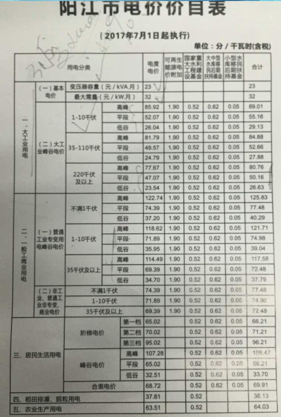
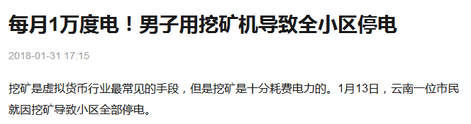
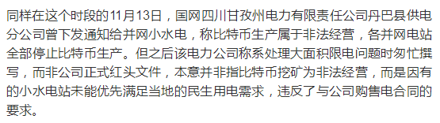
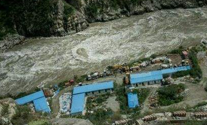
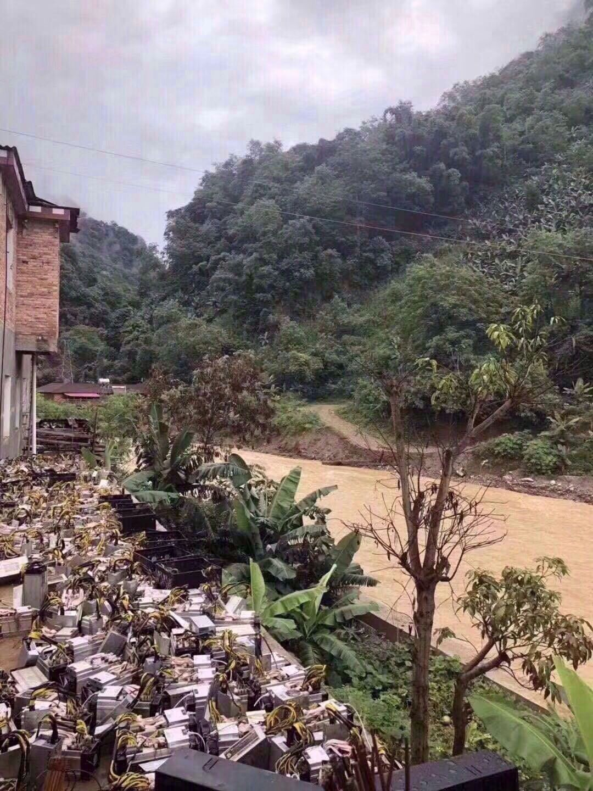
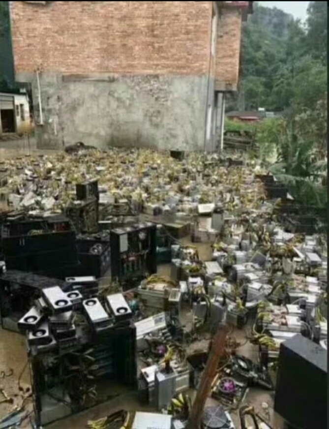
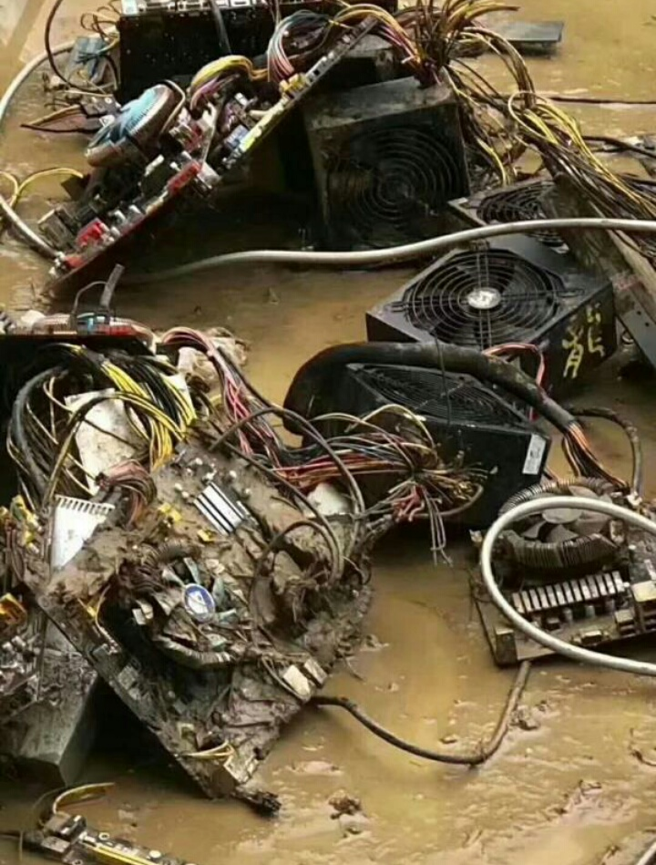
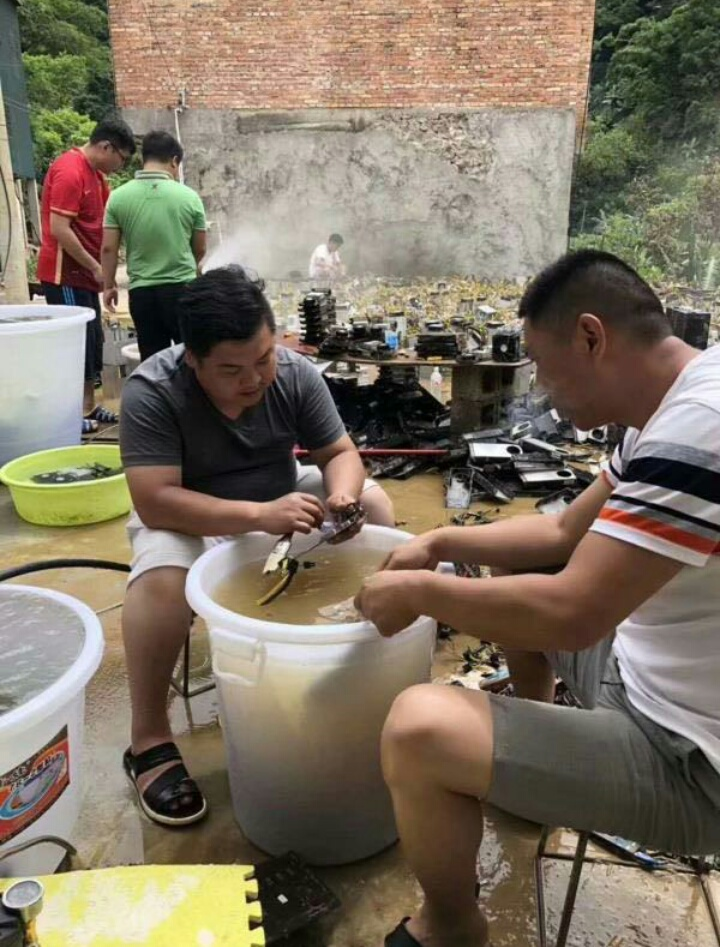
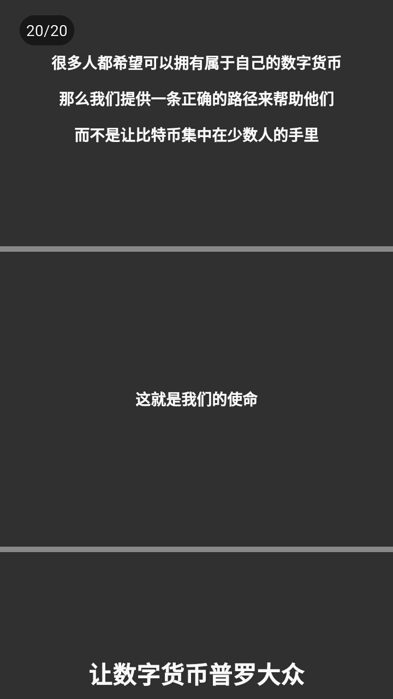
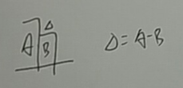

##  第四章  萌生起的idea

开始的时候,原本是想尝试设计矿机然后作为产品来卖的.但是会遇到两个问题,一个是研发成本太高,二是竞争力问题.在华强北调研的时候留心观察到一点,神马矿机的功耗比蚂蚁矿机的功耗要高30 % 左右,产生功耗差距是因为芯片的设计工艺导致的.BM1387 (Antminer S9 所使用的芯片)芯片工艺为16 nm ;SMTI1700 (神马M3 矿机所使用的芯片)28nm .生产16 nm 的芯片成本比较高,所以S9 的售价比M3 高.矿主在计算挖矿收益的时候关心两点:电费和挖矿收益.

一般来说,挖矿收益主要是计算矿机回本周期和每天的挖矿收益.影响矿机每天挖矿的收益主要是看电费价格和挖矿难度还有挖矿模式.挖矿难度决定了每天挖矿收益,电费价格决定了每天挖矿的实际收益(电费是挖矿成本).笔者询问在供电局工作的同学,找到了我们老家的用电价格表:

从表中可以看到,居民用电是分阶梯价格的,如果在家里挖矿,我们必须要按照最高档的电价来计算电费成本,也就是0.95 人民币每度电;使用商业用电(办公楼,商店这类型用电)和工业用电会有区分时段收费,高峰期因为干路上的企业都有大量的用电需求,会增大电力设施损耗,所以高峰期的电价比较贵,反过来看,低峰期电价就非常便宜(电厂发电的机器是一直运行的,即使是夜晚的用电需求很少的情况下,它也会一直运行,因为发电机器暂停运行和启动的损耗成本非常高,远远大于一直发电浪费的成本,低价的电力就是鼓励企业夜间使用).工业用电和居民用电不同的地方再于,用得越多价格越便宜(参考用电阶梯),于是选用工业用电来挖矿.

搭建矿厂的电网需要用到变压器,因为工业用电的线路使用380 V ,需要变压到220 V 供电给矿机.特别要注意两处负载压力,一个是变压器的负载,另一个是外部线路的负载.矿机非常耗电,很有可能因为电力供应不足导致跳闸或者外部线路烧毁,就像这个哥们一样.(参考链接  http://www.sohu.com/a/220072808_100011474)

插个有点偏题的话,笔者和哥们聊电力的时候注意到一点,国家电网是不管发电的,他们只管电力分配,电网搭建还有电力接入.开始的时候他问笔者是不是要自建发电厂,接入到国家电网卖电.他还提到一点,国家电网接入供电厂商的标准开始提高了,淘汰了一批不符合发电能力的发电站(记忆中好像是几十千瓦时以下的发电厂不再允许接入),突然记起,广州从化附近开始有一些小水力发电厂在出售,估计也是因为这个做不下去了.

大部分矿主的矿场都是建在四川和新疆那边,那边的电价很便宜,有些操作是贿赂供电电站的领导违规拉线到矿厂的(参考链接  https://baijiahao.baidu.com/s?id=1588617322083932401&wfr=spider&for=pc),也有在那边做水力发电供电的.

水力发电风险在于:河流的水流周期,洪水防范.河流并不是一直都会流水的,它会有个时间段,有时候水流量多,也会有水流量少的时候,这对电力供应不是个好消息;洪水防范怎么说呢,还是看一起事故,估计这起洪水事故矿主应该损失了几百万.

回到主题,当时的想法很简单,就是研发Sha256 矿机,矿机生产一部分出售,大部分用来自己挖矿.这样做的道理很简单,卖一台矿机的价钱并不能持续营收,买矿机的客户他可以使用这台机器持续营收,这就对厂商来说是不利的(虽然说卖机器是可以赚钱,但是购买机器的成本四个月就能挣回成本了,往后的时间里机器每运行一天都是生产利润,那么厂商为什么不自己先投入大量成本研发然后自己去挖呢?).所以我先投入研发的费用,再用卖机器的收入来对冲矿机生产成本(在当时矿机实际价格远高于生产价,完全可以这么做),然后自行建设矿场,做到持续收入.围绕这一点拿稳前期创业的现金流,再组建矿池和新的主链,打造一个闭环的生态.

**理想很美好,现实很骨感**.笔者尝试给红杉资本发了个BP 试试(BP 链接  !).PPT 最后一段话参考了贾跃亭的忽悠思路,个人感觉写得还是挺有味道的,哈哈哈哈.

按照剧本的发展,投资当然是没有拉到.与此同时开始注意到发币的利润远远比做矿机的收入更高,大部分ICO 都会有投资.于是矿机项目就这么搁置了,后面转向搞起了发币.

还有一种挖矿模式没有提到,就是玩客云的模式.玩客云的营利逻辑很简单,用户买的设备,给迅雷分担了流量压力.网络运营商向互联网公司提供的网络服务,其中有一点是按流量收费.对于互联网企业来说,用户端提供的机器帮企业分担购买流量的压力,节省了网络成本,玩客云官方会按照用户的贡献度来分配奖励,奖金来源就是节省出来的流量费用.

除此而外,玩客云模式还有一点对互联网公司有利.企业网络建设会有很多的设备花费,现在有部分的花费都由用户来承担,对企业来说又节省了成本.
