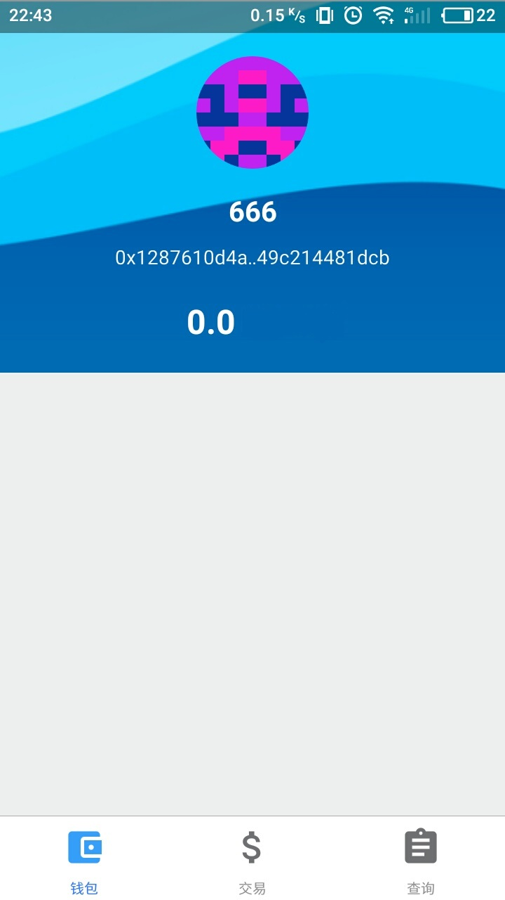

##  第五章  初入币圈

**当你非常想去做成一件事情的时候,身边的朋友可能会有隐藏的资源**.

和第一个投资人见面,他是做金融出生的.当他问到发币的项目盈利周期是多少,每月的回报率是多少.我开始摸不着北了,连忙给他解释发币的收入是不能用每月回报率来评估的,这个不像银行放贷款那样,假设存入利息1.5 % ,借贷利息4 % ,在不计算坏帐的情况下,银行能够稳定收入2.5 % .

他问了我另外一个问题:**虚拟货币是个泡沫,它后面到底价值在哪里呢?**

虚拟货币确实是泡沫,但是在自由经济市场下,只要某种东西有存在的理由,它一定会存在价值.虚拟货币也是货币,货币存在的价值就是为了流通,为了交换.地下黑市特别依赖安全保密的方式来洗钱和出逃资金.先说黑市,澳门赌场提供洗钱服务,操作是洗钱者到赌场赌博,赌场通过控制胜率,让洗钱者一直赢钱,变成合法的收入,然后赌场从中抽水盈利.**钱没有干净和不干净之分**;俗话说文人雅致,用上等的古董书画贿赂官员就不那么明显了,但是如果走的是数字资产呢?这就非常隐蔽了;国家之间的地缘斗争,美国要支持东突分子骚扰我国边境,美国就需要隐蔽的方式来进行资金资助,数字资产就是首选的安全方案;我国对出海的资金管控很严格,在国内捞了一笔钱不容易转出国外,但是可以尝试把钱换成BTC ,然后跑到国外再卖掉BTC 套现.

说白了,虚拟货币解决了:**洗钱,避税,资金出逃**的问题.只要黑色/灰色收入一直存在,虚拟货币就有它存在的理由.

一拍即合之后,我们就开始投入到主网的开发.现在回过头来看,不应该这么快开发主网,而是先发token 炒起市场热度才对,等市场热度起来之后再做主网,然后映射token 的持有量到主网,EOS 就是这么搞的.

确定好了链要解决的问题之后,花了一周的时间修改和美化白皮书的内容.然后给到合伙的哥们(下文称呼他为S )去跑市场,他说手上有很多相关的资源,只要产品到位立马就能够运作.花了大概一个多月的时间,主网就上线了.技术选型是使用ETH 修改的链.因为我们要解决的一个需求是移动支付,所以就需要使用到轻量的APP 端,所以设计成轻钱包,不从链上同步区块数据到本地,如果要做区块数据同步需要花费很多手机的存储空间和流量,应用场景不合适.APP Demo :

S 他之前也发过币,不过他是帮人家运营的,后面他运营那个币翻了很多倍,所以就想自己搞一个币.他的运作模式很简单,首先,他先把币低价卖给直销公司,然后直销公司再转手卖到散户.**币的发行定价都是随意的,不能太高也不能太低**.我们沟通过,定价在0.4 ,就人民币和美金讨论一段时间始终没有确定,S 脑门一热,要搞就搞大的,ICO 价格定价0.4 美金.

纠结人民币和美元这个单位,主要是因为价格相差了6.5 倍.站在投资方来看,他们希望可以持有更多的币;站在发币方来看,他们希望融到更多的钱.当时不太懂,于是就答应这个定价.

请读者们细细思考一下,**你是因为什么原因而炒币?**.笔者想,大部分人都是因为看到币圈的创富传奇而炒币.炒房子是不可能的了,价格这么高,根本买不起;炒A 股又当了韭菜,一直在跌.但是炒币呢,14 15 年买了BTC 持有到现在的人基本都财富自由了.其实再深入去思考一层,现在社会里对生活感到焦虑的人们越来越多,除了高昂的房价之外,还要担心自己的下一代的成长(红黄蓝幼儿园,毒疫苗等等).国人的生活压力很大,解决这个问题很容易,钱没有到位而已,所以他们希望找到一种投资方式,到达财富自由的彼岸.炒币就成为了一种寄托,一种信仰.

投资者希望自己的本金越变越多,那么发币方就需要有针对地对币价进行控盘.发币方控盘的能力取决于:ICO 众筹资金,发币方实力,用户群体.
