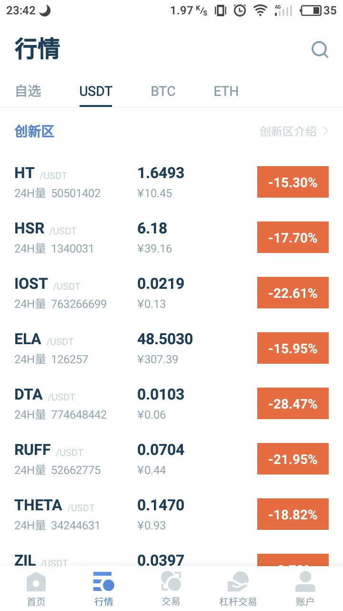
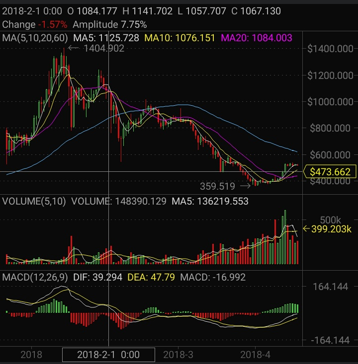
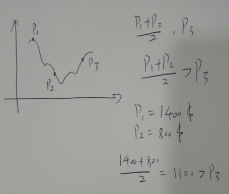
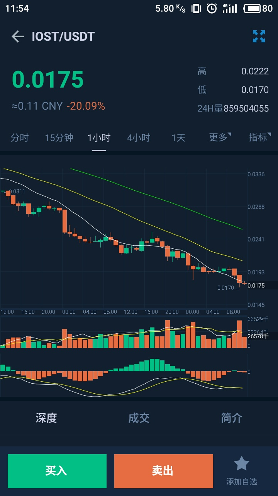
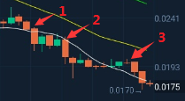
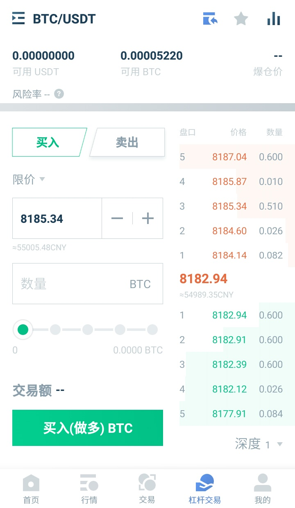
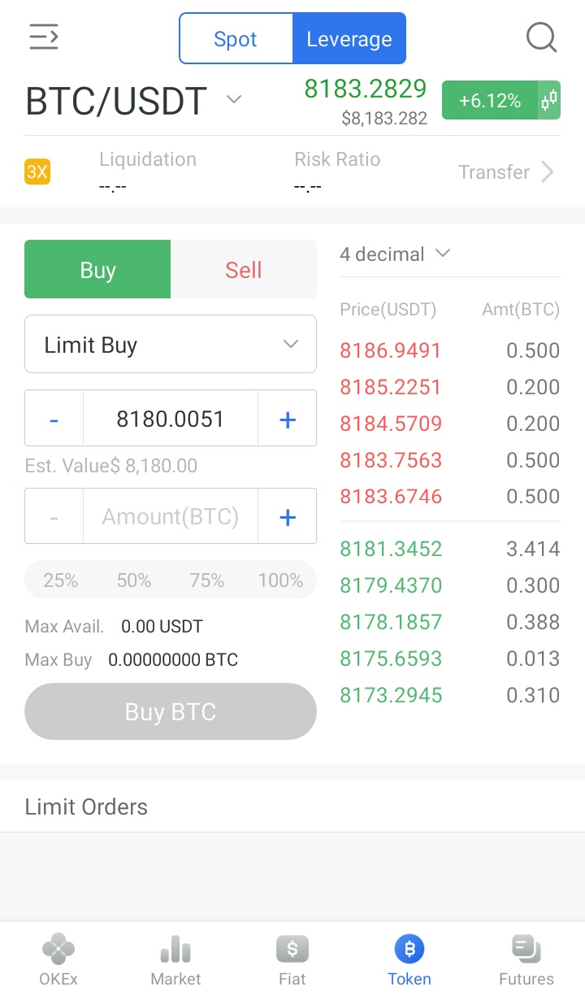
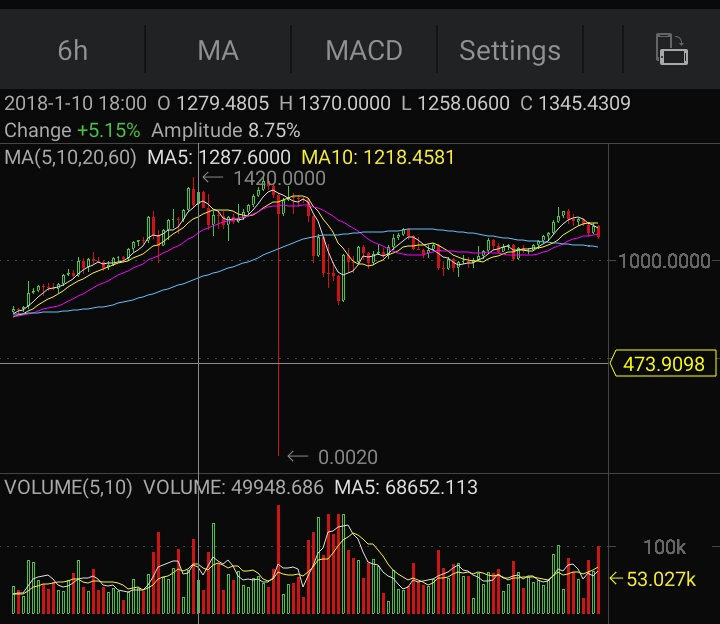
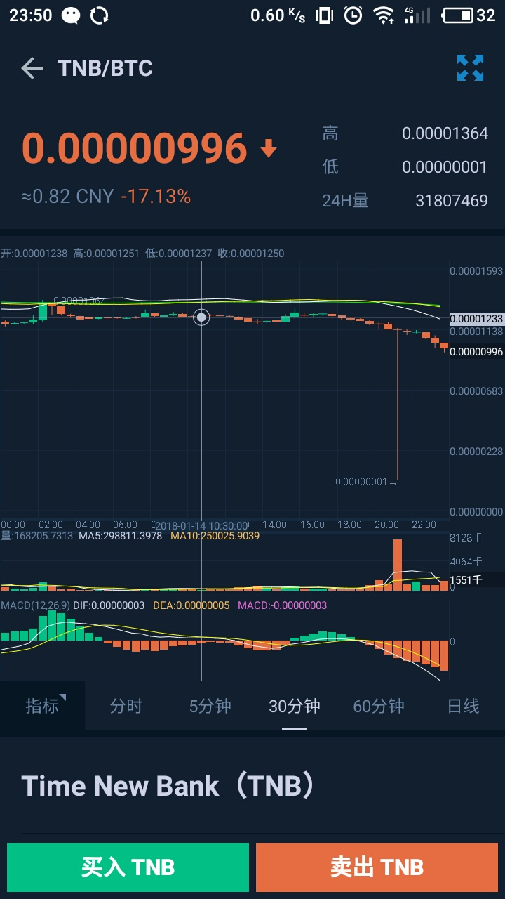

##  第六章  金融游戏

18 年2 月份,币市寒冬以至,所有币种市值都在不断下跌.市场情况相当惨烈.

以ETH 举例,ETH 短线反弹到1 月28 日开始下跌.K 线数据显示,ETH 日线最高的价位是1404.902 美元,最低359.519 美元,价格相差1045.383 美元,折合6899.5278 人民币.

币圈一月,股市一年并无道理.按照2 月份的行情来走,未来的趋势一定还是跌.以股市的逻辑来说,它跌,我就补仓(也称抄底),使得整个仓位的平均价下降,等到价格反弹的时候,只要超过平均价位,那就是盈利了.不妨计算一下(假设每次补仓都是按1 个币作为单位来算):

p1 是第一次买入的价格,买入之后币价开始下跌,此时在p2 处补仓,整体仓位均价变成`p = (p1+p2)/2` .p3 是卖出价格,当均价`p > p3` 时,`p3 - p < 0` ,这意味着亏本了.只有当`p < p3` 时,`p3 - p > 0` ,才是赚到了.上面我们假设`p1 = 1400 ,p2 = 800` ,如果卖出价格`p3 < 1100` ,就亏本了,反之盈利.

在实际情况下,补仓是需要策略的,不是说跌了一点就要补仓,炒股的朋友们觉得跌15 % 就是补仓的信号到了,但是**币市没有底,你永远也不知道哪里是底**,用炒股的仓位管理方法来炒币是不科学的,至少也要是跌30 % ,40 % 才是补仓的信号,因为币价的波动比股市大太多了.

除了补仓之外,另一种方法就是做空.我们用8000 美元买到1 BTC ,等到10000 美元卖掉这1 BTC ,从中就可以赚到2000 美元,这就叫做多,只有BTC 价格上涨才会盈利;我们去找机构或者个人借1 BTC ,然后立即到交易所以10000 美元卖掉1 BTC ,等到BTC 价格跌到8000 美元的时候再买回1 BTC 归还给平台和个人,从中就赚到2000 美元,这就叫做空,当BTC 价格下跌就产生了盈利.用户做空对平台来说存在风险:BTC 价格涨得太高,用户无法承担起归还BTC 的责任,对平台来说坏帐就产生了.所以平台会和用户建立契约,先要交一笔等值的保证金,再根据借贷时的价格来约定爆仓线(爆仓线指的是爆仓价格,如果在10000 美元时借贷1 BTC ,约定爆仓线为18000 美元,此后BTC 价格不断上涨,一旦BTC 价格超过18000 美元,那么平台就会没收全部的保证金,这就叫爆仓),保证平台的利益.

做多的盈利是没有上限的,但是**做空的盈利上限是赚到投资本金**.逻辑很好推理,在10000 美元时借了1 BTC ,转手卖掉赚了10000 美元,然后BTC 价格跌至归零,0 美元买到1 BTC 归还.

也许读者有个疑问,做空的时候到底是谁亏了,用户向平台借贷1 BTC ,平台需要有1 BTC 才可以借给用户去做空,这么说应该是平台的风险,毕竟1 BTC 最后已经从10000 美元变得一文不值.实际上,平台并没有亏,亏的是另外的用户而已.**交易所上的币是由其它用户通过区块链充值进来的,再交易所内部的买卖只是一个数据库操作,只有提现才会走区块链转帐**.交易所是用A 用户的货给了B 用户来做空,所以只是A 和B 的对赌而已,交易所还能从中赚手续费,美滋滋.

既然选择做空,那么有没有办法让做空的利润变得更多呢(盈利超越本金).答案是有的.先来看看IOST/USDT 的历史K 线数据.这一天IOST 跌了20.09 % ,大哥,那个,你要补仓吗.

我们关注这三个位置,分别为1,2,3

如果直接在1 处时做空,到2 处时只盈利了`E = E1 + E2 = E * (R1 + R2)` (R1 ,R2 是跌幅百分比,从1 点的开盘价跌到2 点收盘价,整体跌幅就是R1 + R2).我们做一个理想假设:在1 处开盘价时用本金E 开始做空,收盘的时候买入归还,做空盈利`E1 = E * R1 ` ,此时手上本金变为`E + E1 = E + E * R1 = E(1 + R1)` .然后在2 处开盘价时用E + E1 本金开始做空,做空盈利为:`E2 = E(1 + R1) * R2 ` ,因为在上一次做空中我们已经把本金和做空收入也投入进去,所以本次做空的收益也在增多,此时手上的本金变为`E + E1 + E2 = E + E * R1 + E(1 + R1) * R2` .总结收益:`E * R1 + E(1 + R1) * R2 > E * (R1 + R2)` .

笔者手上有一百万的现金,现在用现金购买等值的国债,那么现在就持有了一百万的国债,笔者再将这笔国债抵押给机构,借款九十万人民币,再去购买国债,然后再抵押再买国债,最后手上会持有五百五十万人民币的国债.笔者用一百万人民币本金做出了五百五十万的效果,这就是杠杆.杠杆能够让一笔钱做出几倍的效果,前面的例子就是做了5.5 倍的杠杆.再举一个杠杆在房地产上应用的例子:首先用一笔钱来修一栋房子,在房子差不多盖好的时候,用它来抵押给银行拿贷款,拿到贷款之后继续修房子,然后继续申请贷款.

杠杆看起来很美好,能让资金的力量变强.谚语常说**凡事总会有两面性**,杠杆有两个主要风险:利息和亏损.

杠杆其实就是借贷,借贷就会有利息产生.以国债例子继续探讨,国债如果每年的收益是4.8 % ,借贷每年的利息是4.35 % ,那么净利润就是0.45 % (本金抵消,只算利息和收益的差值),可以稳定盈利.有过经营经验的读者们应该有经历过,有一笔借款到期催收,一时半会还不上,然后找另外的银行卡或者民间贷款借钱来补缺口,这么操作的风险很高(复利,利息越滚越多),如果新的资金营收填不上借钱的空缺,还是趁早跑路吧.

杠杆放大了投资的盈利,同时也放大了投资的风险.以房子例子继续探讨,设每间房子的价格在一百万,杠杆两间房子.当房地产市价上升时,原本一百万的房子涨价至一百七十万时,总资产为`100 + 2*(170 - 100) = 240 万`;当目前房地产的市价下跌,原本一百万的房子跌价至三十万,总资产为`100 + 2*(30 - 100) = -40 万`.如果觉得你的创业方向前景不错或者经营状况很好又想继续扩张,不妨尝试加杠杆.

回到炒币,我们可以在各个交易所平台上看到杠杆的身影.

杠杆也有爆仓线,一旦超出保证金的范围之外,交易所就会立马爆仓,保证自身不受损失.杠杆也有踩踏事件,上高杠杆的用户被爆仓之后,他们的币就会在市场上抛售,导致价格下跌,影响到上低杠杆的用户,低杠杆的用户又被爆仓了,不上杠杆的用户也要亏得出血.交易所有一波非常秀的爆仓,待我慢慢述说.

读者们会非常诧异这一根针为什么会跌到0.002 美元这个价位.OKEx 的解释是深度机器人出现异常,导致交易所撮合系统的成交价也出现了问题.与此同时,大部分做多杠杆帐户都被无缘无故地爆仓了,但是实际的价格并没有跌到0.002 美元,稍后深度机器人恢复之后,价格正常,只可惜了被爆仓的用户了(参考链接  http://www.cngold.com.cn/zjs/20180322d1897n216943361.html).像这样的恶意爆仓的例子还有很多,就不一一列举了.火币同样也存在深度机器人异常崩溃导致成交价也异常.

S 说,搞金融的都是骗子,他们可黑了.
