##  第七章  穷逼,别学人家发币

发币的过程大致分几个步骤:吹逼,吹逼,还是吹逼.币价涨得高,吹逼吹得好.**无论是做区块链项目发币,还是提出一个技术概念,概念越模糊越好,越难落地越好,这样人们就听得云里雾里的,够抽象,第一直觉就是很高大上.切记千万不要拿概念和已有的产品来做对比(比如说这个东西就像xxx 一样),人们会醒悟过来原来也就这么回事或者提问这个东西和现有产品的差异在哪**.EOS 很适合在此举例子.

EOS 无非也就是联盟链+DAPP 而已,没有什么大不了的,而且节点部署比ETH 困难,写智能合约编译也特别复杂(ETH 的solidity 很简约,甚至在网页上都能调试;EOS 的智能合约得用二进制编译,而且不容易调试,搞得笔者头皮发麻).从技术层面上来说ETH 比EOS 要好太多了(ETH 是PoW ,EOS 是PoS),但是EOS 懂得运营,市场搞开了,自然也就多人来关注这个币.

**运营第一,技术第二.技术只是一个壁垒,突破技术壁垒需要的是人和时间而已.**.但是市场和运营就完全不同了.

S 想沿用他之前的那套方案,从传销开始搞起来,表面上看起来他好像懂区块链的运营部分,实际上他只知道传销币的套路的做法.一级直销公司买到他的币之后,以十倍价格分发给他下面的用户,他管这叫私幕.因为币圈没有大佬站台,他只能在twitter 和facebook 上找网红来做宣传.期间还在一些小型会议上宣传这个币,但是推广效果一直不好.

炒币的朋友们用得比较多还是币世界和金色财经这类看咨讯的APP (后来了解到这两家咨讯APP 实际都是同一个老板,属于火币),于是联系他们的商务,发广告的收费为2 ETH ,前提是发币的项目必须要上过交易所才可以.

在运营和推广的过程中,很多人都会问的一个问题,你们的币上交易所了吗.确实,就连空气币都能上交易所,不上交易所的币从则面的角度就反映出项目方的实力,也有可能是骗子,用币的名义骗一波钱就跑.每个人都担心出现这种风险.所以,当务之急就是要找到一家交易所,对接上线交易.

联系到香港的一家交易所,他们那边有两个选择给项目方:1.缴纳60 万人民币作为押金,在三个月内达到规定的成交量且项目方不跑路,这笔押金就可以原数归还;2.缴纳30 万人民币作为上架费,交易所会提供部分宣传推广和上币的服务.

这个价格算是挺实惠的了,火币pro 上架费800 - 1300 万人民币,hadax 竞价上币更不止这个价(hadax 没有pro 那些交易指标,交易指标一旦达不到交易所的要求,那么就会被下架),zb 上架费1200 万.新币没必要在起始阶段就在这些大交易所上发行,不如把这些上架费花费于多上几个小交易所,创造利好消息.

思索再三,还是选择了直接缴纳30 万的上架费,让交易所那边也帮我们宣传宣传,后来交易所那边帮忙打通了渠道,能在币世界上发广告了,价格照旧2 ETH .人脉真的很重要.

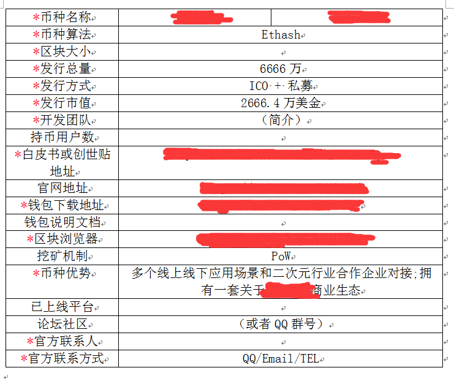

上交易所交易之前,发币方还需要做一个非常重要的工作 -- 摆盘.在讨论摆盘之前,先来了解一下在交易所里的买卖是怎么样成交的.

交易市场上有两方:买方和卖方.在交易所里面的买卖都是需要挂单的,这张交易单里包含买卖请求,期望交易价格和数量.举个例子:有人希望500 美元买入1 ETH ,有人希望501 美元买入1.2 ETH ,有人希望503 美元卖出0.5 ETH ,那么交易所上的挂单是这样的.

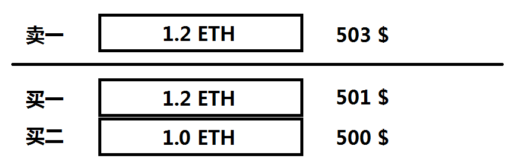

买一和卖一指的是最接近成交价的挂单,在买一后面的就是买二.此时有新的挂单,501 美元卖2.0 ETH ,挂单状态被刷新.

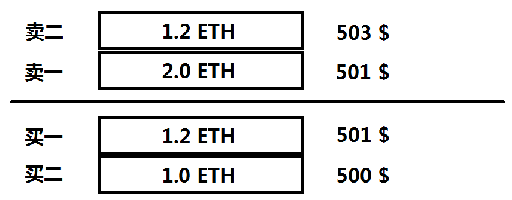

现在,市场上刚好有买卖两个单子,交易所把这两个买卖单撮合成交,买一成功买到1.2 ETH ,但是卖一还剩下0.8 ETH 没有售完,成交价被刷新,501 美元.

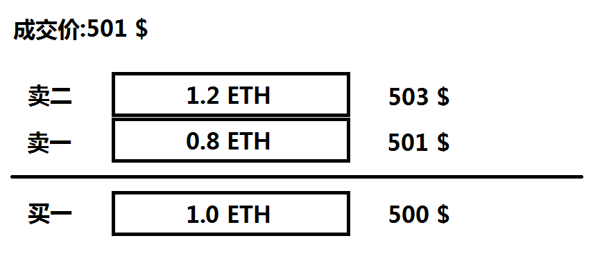

这个时候市场上又有人挂了卖单,500 美元卖3 ETH ,交易所撮合完成这笔买卖,成交价更新为500 美元.

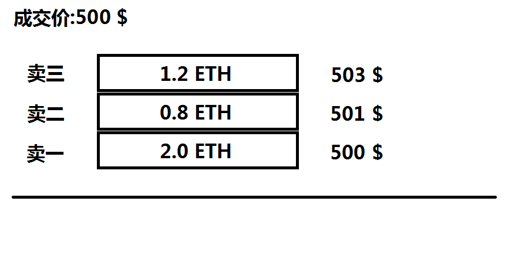

交易数据里面有一个模块叫深度,意思是买卖两边都会有不同期望价格和数量的挂单,它们一并组合起来就成为了深度,先看看买卖盘的数据.

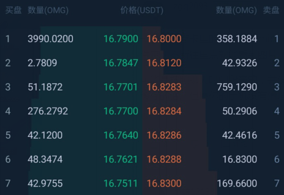

可以看到,买卖盘的挂单数量还是挺多的.深度图只关注挂单数量,让我们把挂单的数据组合成一坐小山,山的高度就是挂单的数量,中间山谷的位置就是成交价.在中间(16.7950)的左边是买盘的深度,越往左价格越低,反之亦然.

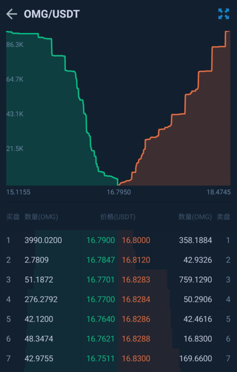

交易深度可以用来反应当前的盘口的活跃程度,如果没有什么交易量的交易所,盘口深度是比较浅的.观察下图的交易价格差和挂单数量.

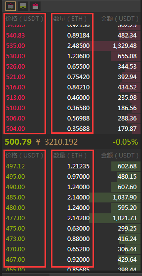

另外,深度也可以看到当前是否有大户在砸盘和拉盘.观察下图买盘深度.

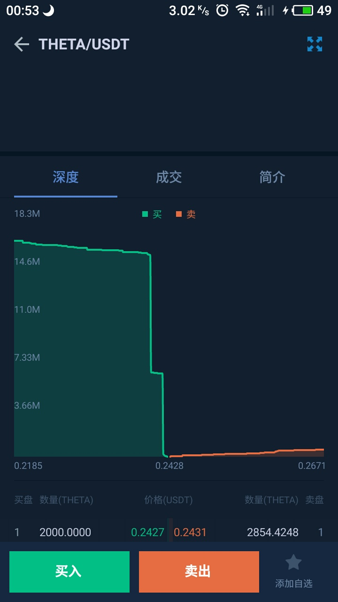

拉盘和砸盘的原理很简单,假设我手上有足够多的钱,我就把场上的卖单全部都买掉,成交价就不断地上升,举个股市涨停的例子:

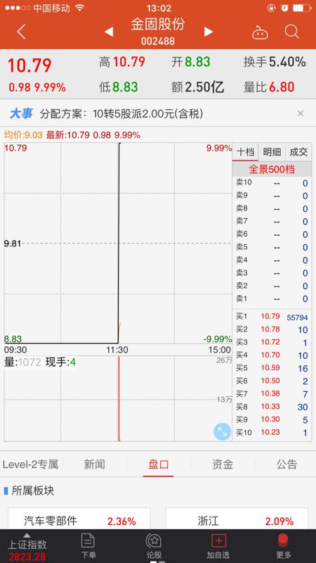

卖盘上的挂单基本被吃干净了,所以目前市场上没有人卖,那么价格就被拉到顶了.看买一的挂单显然是个庄家在拉盘,买一这个价位(10.79)有`10.79 * 100 * 55794 = 60201726` 人民币的资金(合计6020 万),如果我的手上持有55794 手股,然后抛售,我就可以平掉全部的买一挂单,如果我的手上再有100 手股,继续在市场上抛售,就可以把价格砸到10.23 以下(因为买2到买10 的挂买总量只有81 手).拉盘砸盘就是要比谁手上的货够多.

了解完成交的原理和拉砸盘的原理之后,再回来说摆盘.

**每个人的内心都有一个预期的心理价位**.上交易所后的价格是ICO 的两倍,有部分人就会在这个时候选择抛售现货.发币方要根据自身的资金实力(资金实力来源包含ICO ,项目方本身资金实力和其他币圈庄家的资金)来计算好拉盘资金.还有,刚上交易所的时候最担心就是持币大户的大量抛售,这些持币大户一般是参与ICO 的用户和私幕的用户,所以发币方在私幕和ICO 的时候会控制好锁仓时间和每个月发放币的数量,防止被他们砸盘,因为破发(跌破发行价)是一件非常严重的事情.

有幸在一些币开始交易之初拍下了深度图,故此整理并分析一个摆盘实例.

这个是NEO 刚上线时的深度图,看起来并没有什么问题.

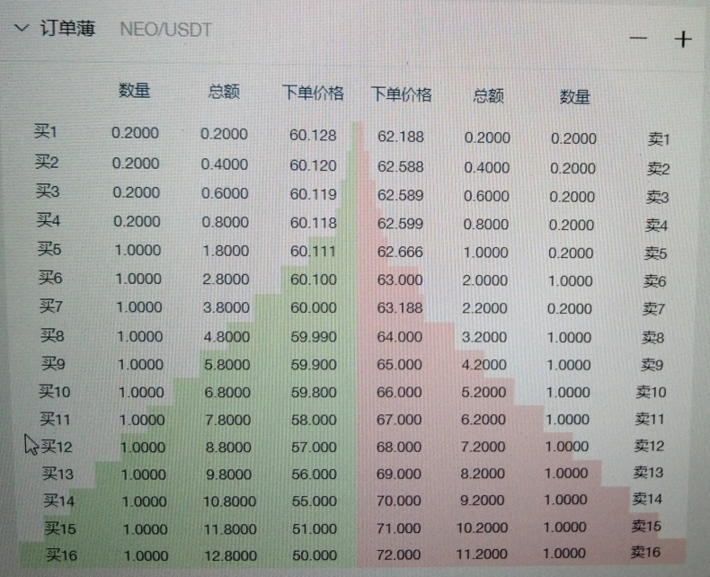

接下来把深度的精度调大再观察观察.

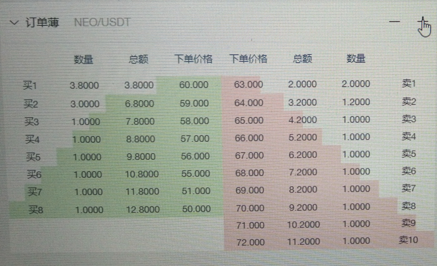

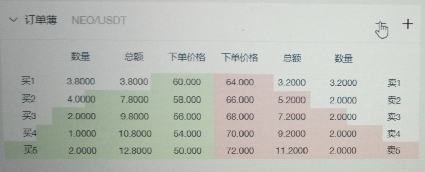

可以看到,这里的深度其实还是很浅的,要把整个NEO 的买盘给砸穿,成本只需要12.8 NEO ;要把整个卖盘给拉飞,成本只需要756.8 USDT ,假设把买盘全清了,然后挂一个0.0000001 的NEO 卖单,数量不限,再自己操作过去买这个卖单,成交价就刷新在了0.0000001 USDT 这里了.

聪明的读者们来自行分析一下这个摆盘深度.

后来和S 分道扬镳了,他只是个大忽悠,其实他的资源并没有多少,钱就更不用说了,连运营的费用都不够.ICO 没筹到多少,基本上官网上发售的数据量都是自己在调的,实际上也就筹到了2.3 ETH .
