##  第八章  一触即发


2018 年4 月22 日,BEC (美链  https://etherscan.io/address/0xc5d105e63711398af9bbff092d4b6769c82f793d)被爆智能合约中存在安全漏洞,导致一笔非常大的转帐产生,转移到某个帐户中去.

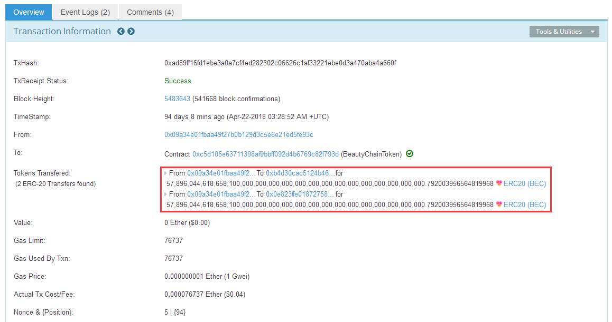

随后,黑客把BEC 转入到交易所进行抛售,此时场上交易价格急剧下降.

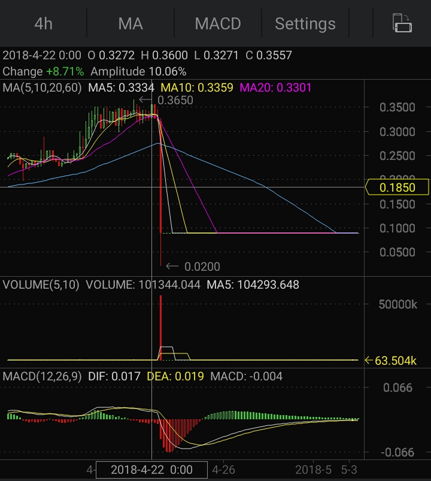

4 月22 日中午开始,BEC 币价开始跳水,OKEx 监控到BEC 存在异常交易,立即发布关闭交易公告.


漏洞的原理比较简单,因为在多重转帐的代码中出现了整数溢出.先看代码(链接  https://etherscan.io/address/0xc5d105e63711398af9bbff092d4b6769c82f793d#code):

```solidity

    function batchTransfer(address[] _receivers, uint256 _value) public whenNotPaused returns (bool) {  //  _receivers 是转帐地址列表,_value 是向每个地址转帐的数量
        uint cnt = _receivers.length;                   //  转帐地址数量
        uint256 amount = uint256(cnt) * _value;         //  整体转帐数量 = 转帐地址数量 * 向每个地址转帐的数量
        require(cnt > 0 && cnt <= 20);                  //  只允许同时向20 个以内的转帐地址进行同时转帐
        require(_value > 0 && balances[msg.sender] >= amount);    //  检测钱包里面有足够的余额进行转帐

        balances[msg.sender] = balances[msg.sender].sub(amount);  //  先扣除帐户里的余额
        for (uint i = 0; i < cnt; i++) {                          //  循环对每个帐户的地址进行转帐
            balances[_receivers[i]] = balances[_receivers[i]].add(_value);  //  目的帐户余额增多
            Transfer(msg.sender, _receivers[i], _value);                    //  触发转帐事件
        }
        return true;
    }

```

注释里已经标明白代码的执行过程.在计算机运行的过程中,数据是有存储范围的,我们知道计算机是由01 两个数值组成的,`0 + 1 = 1,1 + 1 = 10` 计算机识别的数据是二进制,和人类的十进制计数方法不同.一条电路有高电压和低电压两个状态,那么计算机就规定好了,高电压表示为1 ,低电压表示为0 ,一条电路就是表示为1 位(取值为0 ,1).我们常看到的计算机存储的单位是字节,计算机规定1 字节=8 位,也就是说一字节可以存储的数字范围为(0,1,2,3 ... 255 ,一共是2 的7 次方个组合),同样的道理,4 字节的取值范围是0-4294967295 (2 的31 次方).

uint8 是指无符号数据存储长度为8 位的整数(无符号是指数据只能是正整数,不能为负数,细节在此就不讨论了),那么它的取值范围是:0-255 (2 的7 次方).我们假设`uint8 data = 255` ,然后`data += 1` 会发生什么事情呢.

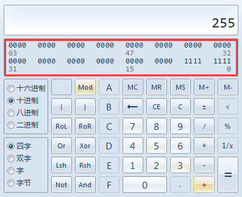

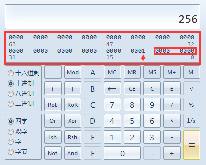

注意小箭头中指中的1 ,因为这次计算已经超出了uint8 的取值范围,那么1 就会被丢弃掉,计算机只保留后面的00000000 ,最后结果为0 .

我们来关注这三行代码:

```solidity

    uint256 amount = uint256(cnt) * _value;         //  整体转帐数量 = 转帐地址数量 * 向每个地址转帐的数量

    require(cnt > 0 && cnt <= 20);                  //  只允许同时向20 个以内的转帐地址进行同时转帐
    require(_value > 0 && balances[msg.sender] >= amount);    //  检测钱包里面有足够的余额进行转帐

    balances[msg.sender] = balances[msg.sender].sub(amount);  //  先扣除帐户里的余额

```

amount 有没有存在为0 的可能呢,答案是肯定的.注意,代码里面cnt 和_value 都是用户可以控制的值.

当_value = 0 时,cnt = 2 ,`amount = 2 * 0 = 0`.在`require(_value > 0 && balances[msg.sender] >= amount);` 因为不满足条件`_value > 0` 而退出运行.

当_value = 任意 时,cnt = 0 ,`amount = 0 * n = 0`.在`require(cnt > 0 && cnt <= 20);` 因为不满足条件`cnt > 0` 而退出运行.

但是,当_value = 8000000000000000000000000000000000000000000000000000000000000000 时,cnt = 2 ,`amount = 8000000000000000000000000000000000000000000000000000000000000000 * 2 = 0` (整数溢出).`require(_value > 0 && balances[msg.sender] >= amount); require(cnt > 0 && cnt <= 20);` 两个条件都被满足.

继续往下,`balances[msg.sender] = balances[msg.sender].sub(amount);` 实际上是扣除了0 的余额.但是`balances[_receivers[i]] = balances[_receivers[i]].add(_value);` 则是转帐了`8000000000000000000000000000000000000000000000000000000000000000 BEC`.

自从BEC 出现了漏洞之后,SMT 和EDU 也出现了安全问题,最后结局都一样,币价接近归零.

SMT 停牌调整

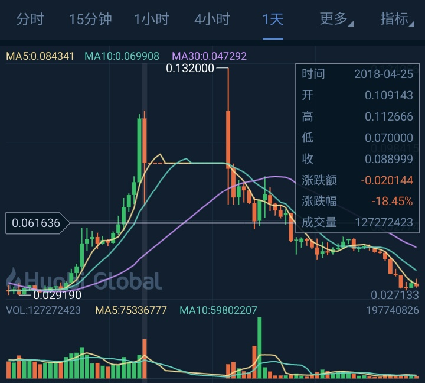

EDU 停牌调整


币圈不止上面这些安全问题,还有交易所的问题.先以慢雾区发现的假充值漏洞为例子:

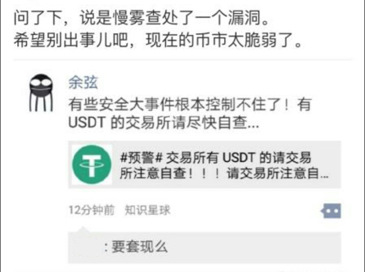

按照国内安全圈的惯例,发现了重大漏洞都得要宣传一波,业内人自称安全娱乐圈(并没有针对慢雾的意思,这个现象普遍存在).

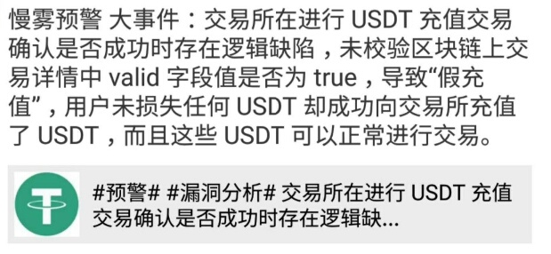


漏洞被爆出来之后,USDT 价格小幅度回落.

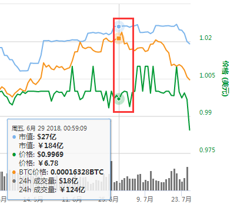

漏洞原理很简单,交易所在处理USDT 充值时,会检测链上返回的转帐数据,数据内容里面有一个字段`valid` ,它是用来标识转帐是否成功.其实这是交易所的处理问题,并不是什么严重的漏洞,如果根据valid 字段来判断转帐状态,有可能会导致区块链上的转帐还没有转到交易所(需要多个区块链网络接收到这笔转帐才是真正转帐成功),交易所这边就已经在数据库上添加了余额.


2018 年5 月22 日,OKEx BTC 交易板块出现异常,坊间传言OKEx 遭黑客入侵,BTC 价格从8392.0 美元直线跌至6000 美元附近.

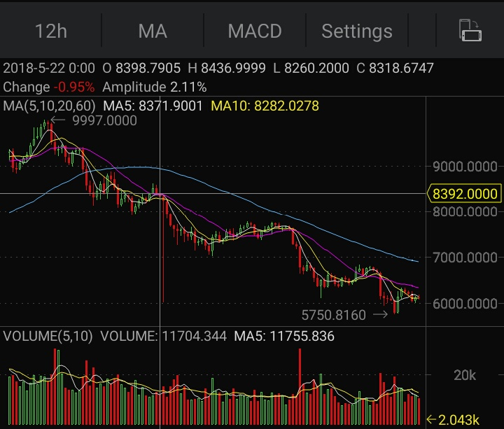

后来了解到的细节是交易所站内互转BTC 出现BUG ,转出方不扣BTC ,收款方依旧可以收到BTC .下面是用户利用BUG 刷BTC 的截图:


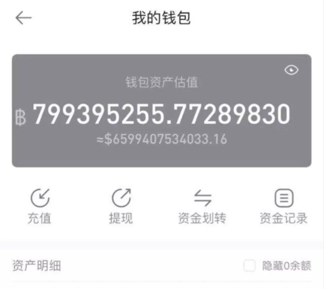

5 月22 日夜间20:49 ,OKEx 官方回应BUG .


区块链安全包含了许多部分.对交易所来说,除了传统WEB 安全之外还有区块链钱包安全(钱包保存用户和交易所的数字资产);对于项目方来说就是区块链上的节点和客户端安全了.笔者以360 挖到的EOS RCE 为例子(360 官方分析链接  http://blogs.360.cn/blog/eos%E8%8A%82%E7%82%B9%E8%BF%9C%E7%A8%8B%E4%BB%A3%E7%A0%81%E6%89%A7%E8%A1%8C%E6%BC%8F%E6%B4%9E/),讨论区块链节点安全.先看看漏洞描述.

```

    我们发现了EOS区块链系统在解析智能合约WASM文件时的一个越界写缓冲区溢出漏洞，并验证了该漏洞的完整攻击链。

    使用该漏洞，攻击者可以上传恶意的智能合约至节点服务器，在节点服务器解析恶意合约后，攻击者就能够在节点服务器上执行任意代码并完全控制服务器。

    在控制节点服务器后，攻击者可以将恶意合约打包进新的区块，进而攻击和控制其他新的节点，最终攻击和控制整个EOS网络。

```

越界写缓冲区溢出漏洞(Heap overflow Write)可以让攻击者控制堆内存的内容,程序保存在堆内的数据各种各样,要想通过溢出写来控制程序的执行流程,首先要在堆内找到一个函数地址,然后溢出写来修改函数的地址,然后触发函数调用,这样就可以控制程序的执行路径到我们上传的恶意代码了.为什么EOS 会出现这个问题呢,是因为EOS 的智能合约虚拟机是使用C++ 写的,用这种底层的语言写的程序没有做好处理容易出现二进制漏洞.但是ETH 就不会出现,因为EVM 是用Python 写的,Python 是脚本解释器,黑客要做到沙盒绕过必须先找到EVM 的漏洞,任意执行Python 代码,接下来再挖Python 解析器的漏洞,使用Python 触发Python 解析器的漏洞来执行二进制代码.

DAPP 的设计模式是在链的节点上部署一个虚拟机,让虚拟机可以执行智能合约的代码.区块链上的数据会在各个节点上同步,所以上传好的智能合约最后会同步到各个节点保存,如果节点程序存在漏洞,那么黑客向节点发送调用合约,节点就会因为漏洞崩溃或者被入侵.正因如此,EOS 在hackone 上给出有价值的漏洞还是很合理的.

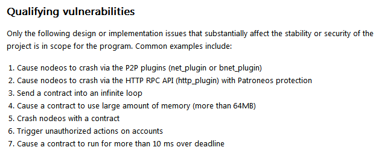
