##  第九章  交易所的秘密

做区块链行业最赚钱还是开交易所,其次是发币.不妨先来看看各大交易所的日成交数据.

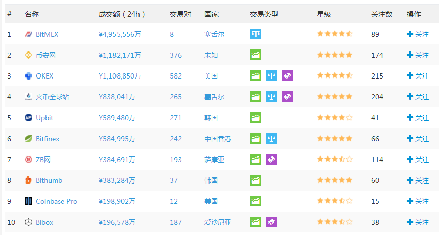

交易所在撮合买卖单成交时会收取手续费,买单卖单各收取千分之二(0.2 %),交易所从中可以获利amount * 0.004 ,意思是1 BTC 在市场上成交,成交价为10000 美元,交易所对买方赚得手续费20 美元(10000 * 0.002 = 20),对卖方赚得0.002 BTC (1 * 0.002 = 0.002).币市交易所的手续费一般为0.002 ,再来看看上海证券交易所的手续费.

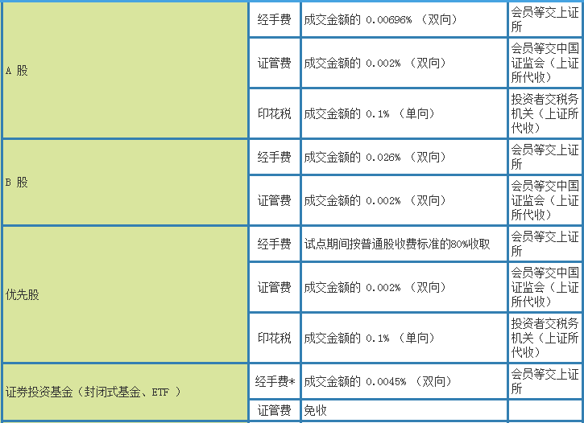

粗略计算,OKEx 每天收入`1108850 * 0.004 = 4435.4 万`,火币每天收入`838041 * 0.004 = 3352.164 万`.开交易所收入太恐怖了,而且还是每天稳定的现金流.

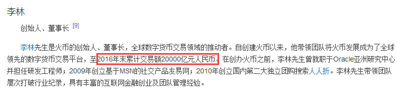

不知道读者有没有忘记第六章里提到的深度机器人.实际上,交易所会利用深度机器人对交易盘口进行调整,举个例子,刷交易成交量.交易所成交量是衡量交易所规模水平的一个重要指标,所以交易所会在某些时间段内偷偷做手脚.

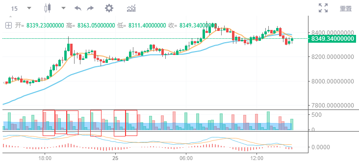

注意红框里面的成交量,怎么会这么有规律.再看看另一个交易所上的数据.

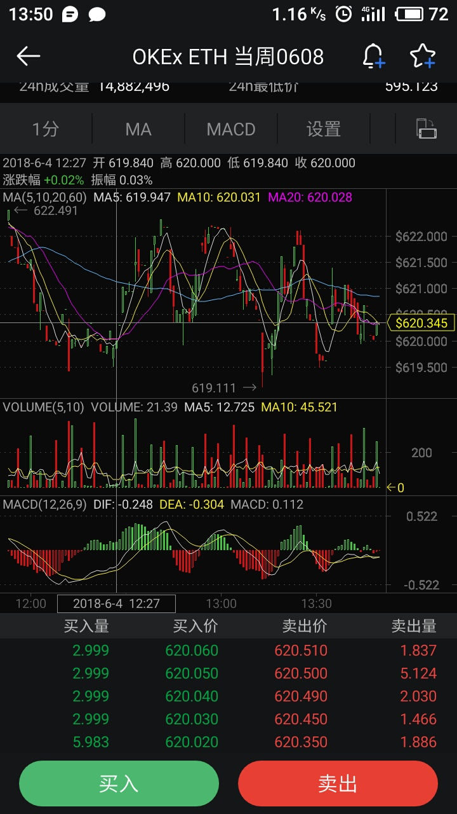

请注意看成交量.

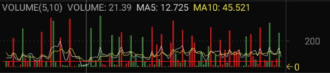

实际的成交量应该是在红线附近,但是交易所的机器人刷出来的成交量太明显,一眼就能看出来.下面就是一些机器人的挂单(仔细观察红框的挂单数量):

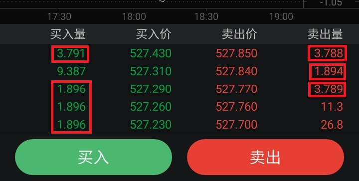

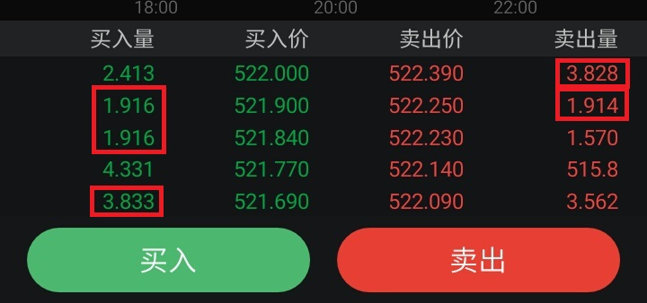

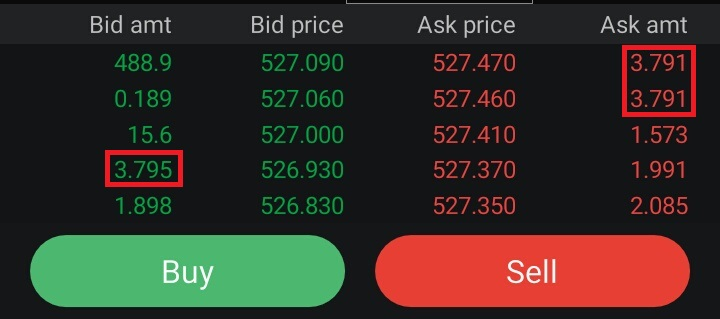

深度机器人除了刷成交量,还有一种用法是做波段.交易所在没有成交量的驱动下,往往会导致一些买卖挂单无法被成交,一直挂在原来的位置不动.所以交易所需要自己做一些波动出来对这些挂单进行撮合(注意,只有在横盘的时候才这么做).让来看一个实例:

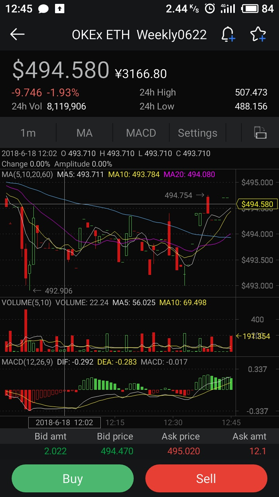

可以看到,K 线上出现了多处横线(这说明了单位时间内开盘价和收盘价一样),这是交易量低迷的信号.深度机器人此时做了小波段,撮合一些存在的挂单.

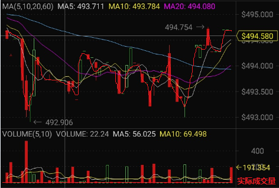

找准规律之后,上了一波20 倍杠杆来进行验证,收益12.47 %

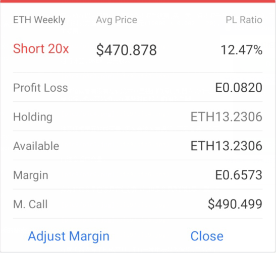

深度机器人就是交易所的小操盘手.相信读者弄明白深度机器人的原理和意义之后,要明白交易所的成交量是存在一定水分的.新闻截图(参考链接  http://www.freebuf.com/articles/neopoints/165125.html)

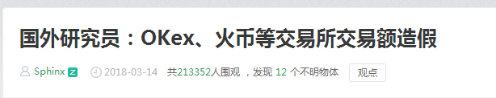

交易所之间的价格是互相参考的,而且交易所上不一定会有现货供应,所以A 交易所会到B 交易所去购买,实际上是帮在A 交易所上挂单购买的用户在另外的地方代购了.所以(还有搬砖也有影响),每家交易所的价格会互相影响.

提到交易所搬砖,笔者先分享一下自己感悟到的互联网盈利模式:服务费,广告,圈钱.王者荣耀一个季度收入两百多亿,几乎都是游戏的消费,那么用户购买游戏道具,其实也是归类为游戏厂商给用户提供服务而赚取到的盈利,美团,滴滴,腾讯云都属于服务费盈利模式;广告很好理解,就是单纯依靠广告进行盈利,最出名的例子就是百度.读者们有没有想到,地铁站和办公楼附近的自动售货机到底是因为什么来盈利的呢?卖饮料能挣几个钱,主要的收入还是售货机上的电子显示屏推送的广告;圈钱怎么理解呢,以共享经济为例子,用户交付到平台的押金表面上是防止用户损坏和直接偷取厂商提供的事物,实际上,厂商会利用所有用户的押金进行其他的投资从而赚取更多的盈利,所以会限制用户每天的取款上限,防止大量用户取款导致资金崩盘.关于圈钱还可以举微信支付和支付宝这两个例子,读者们细细琢磨一下.

搬砖原理其实很简单,每一个交易所上的交易价格都有所不同.比如Bitfinex 上ETH 市价500 美元,CoinEx 上ETH 市价506 美元,那么这里就存在**价差**.搬砖(金融术语为套利)的核心操作是低买高卖.举个例子在Bitfinex 上低价买入1 ETH ,然后在CoinEx 上卖出1 ETH ,这样就可以赚到6 美元,盈利率为`6/500 = 0.012 = 1.2 %` .

但是实际上,我们是不可能立即在A 交易所买然后到B 交易所卖,因为在A 交易所提现到B 交易所的帐户回走区块链,那么就存在转帐延时.延时的风险在于,在A 交易所500 美元购买的ETH 可能成功转帐到B 交易所之后ETH 价格下跌到497 美元,那么就亏损了.为了解决这个问题,我们手上需要有足够多的现货.

假设我们手上有10 ETH 和10000 USDT .分别把5 ETH 和5000 USDT 充值到A B 交易所的帐户.

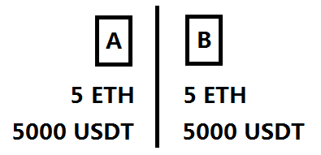

接下来,市场上出现了套利机会.A 交易所ETH 市价470 USDT ,B 交易所ETH 市价473 USDT .此时在A 交易所买入低价的ETH ,同时在B 交易所卖出相同数量的ETH .假设买卖数量为1.8 ETH ,接下来A B 交易所不存在价格差,双边的帐户余额如下:

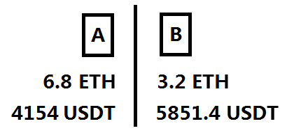

套利系统不断地在运行,最后会有一边的帐户余额无法继续交易,所以需要事先计算好触发转帐金额的警戒线.一旦达到警戒线之下,触发交易所之间平衡帐户余额.这样做的话就无需要担心在套利时的时间风险问题了.这是笔者的套利模型:

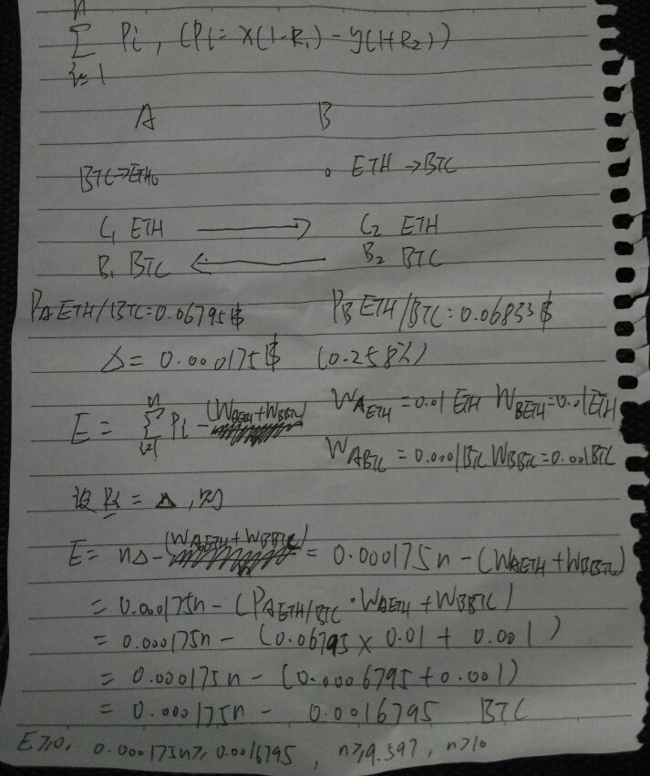

在实际套利环境里,我们还需要考虑两边交易所的手续费(R1 ,R2)和提现手续费(WaETH WbETH WaBTC WbBTC),只有先把套利成本赚回来才存在盈利.最后的计算是,每次套利盈利0.256 % 时,需要10 次套利才可以赚到提现成本,所以搬砖是有最低搬砖资本的,一旦低于这个成本,转帐的时候就会亏本,必须要有足够多的资本才能够减小风险.这是笔者写的自动化套利系统.

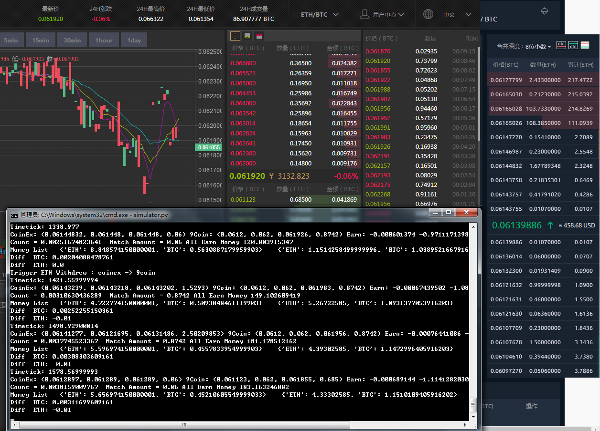

交易所里面的现货,都是用户充值到平台上的.这些币放着也是放着,不如把它们用来币生币.**牛市赚钱熊市赚币**,一位搞量化交易的朋友如是说.

平台发币,主要是配合平台自身的玩法来做的.比方说HT ,HT 结合HADAX 做上币竞价排名,每一次开启投票上币,币价都会上涨(项目本身大量购买HT 来投票,也就是拉盘),每一次投票结束之后,币价都会回落(没有竞价成功的项目抛售HT ,也就是砸盘).不得不说HADAX 的竞价上币套路厉害,竞价成功的项目至少也得花费几千万.

2018 年6 月末,FCoin 推出交易挖矿,意思是用户在交易所上进行交易,平台会返回平台币给用户持有.用户每一笔交易都能赚到币,他们就会有套现的需求,于是用户们在市场上大量抛售平台币,那么它就一文不值.所以FCoin 为了能让交易挖矿出来的币能够让用户长期持有,于是加入平台分红机制,让交易挖矿出来的平台币有分红的效果,防止用户抛售,另外还能刺激交易量,两全其美.

交易所还有很多内幕,比如说庄家控盘,恶意爆仓,集体跑路等,在此就不多述说了,还是希望读者们能赚多多.
